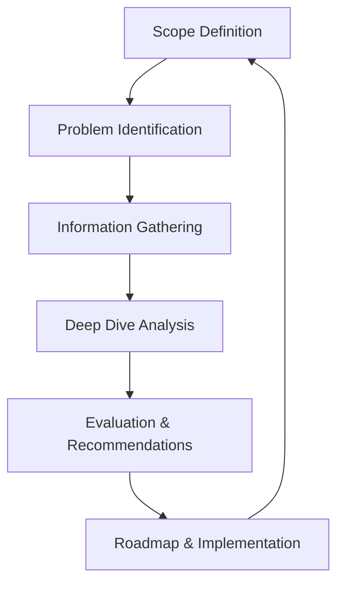
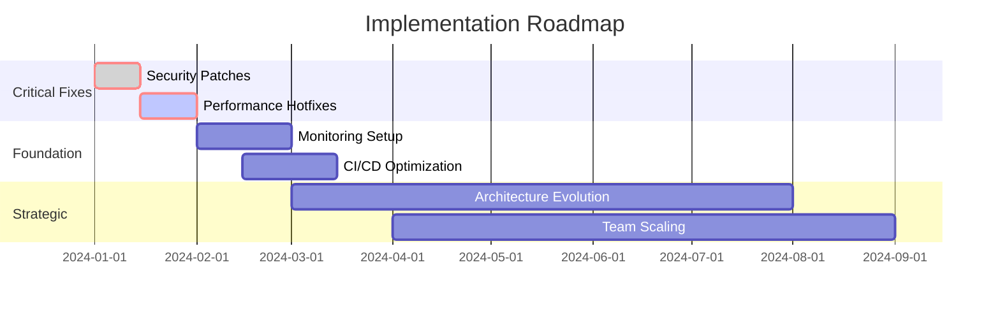

# System Analysis Fundamentals: A Practitioner's Guide

System analysis is the cornerstone of building scalable, maintainable software systems. After conducting 50+ system analyses across various domains, I've distilled the key principles and methodologies that consistently lead to successful outcomes.

<!--truncate-->

## What is System Analysis?

```python
def system_analysis():
    """
    Systematic examination of a system to understand its components,
    interactions, and optimization opportunities
    """
    return {
        'understanding': 'How the system currently works',
        'identification': 'Pain points and bottlenecks',
        'recommendation': 'Improvement strategies',
        'planning': 'Implementation roadmap'
    }
```

System analysis goes beyond just reviewing code or architecture diagrams. It's a holistic evaluation of:

- **Technical architecture** and implementation patterns
- **Business processes** and user workflows  
- **Team dynamics** and development practices
- **Infrastructure** and operational procedures

## The SPIDER Framework

Over the years, I've developed the **SPIDER** framework for systematic analysis:



### S - Scope Definition

```yaml
scope_definition:
  boundaries:
    - system_components_included
    - integration_points_covered
    - time_period_analyzed
    
  stakeholders:
    - technical_team
    - product_owners
    - business_stakeholders
    
  success_criteria:
    - performance_improvements
    - scalability_targets
    - maintainability_goals
```

**Key Questions**:
- What specific system components are we analyzing?
- Who are the primary stakeholders and what are their concerns?
- What does success look like for this analysis?

### P - Problem Identification

Start with understanding the symptoms before diving into solutions:

```bash
# Common problem indicators
$ analyze_symptoms --performance --scalability --maintainability
- slow_response_times: "User complaints about page load speed"
- deployment_friction: "Features take weeks to deploy"
- bug_frequency: "High production incident rate"
- scaling_challenges: "System struggles under peak load"
```

**Problem Classification**:

| Category | Indicators | Impact |
|----------|------------|--------|
| **Performance** | Slow responses, timeouts | User experience, conversions |
| **Scalability** | Resource limits, capacity issues | Growth limitations, costs |
| **Maintainability** | Hard to change, bug-prone | Development velocity, quality |
| **Security** | Vulnerabilities, compliance gaps | Risk, regulatory issues |

### I - Information Gathering

Comprehensive data collection from multiple sources:

```python
def gather_information():
    sources = {
        'technical_metrics': collect_performance_data(),
        'user_feedback': analyze_support_tickets(),
        'team_insights': conduct_stakeholder_interviews(),
        'system_docs': review_architecture_documentation(),
        'operational_data': examine_incident_reports()
    }
    
    return synthesize_findings(sources)
```

**Information Sources**:
- **Quantitative**: Performance metrics, error rates, resource utilization
- **Qualitative**: Team interviews, user feedback, pain point discussions
- **Documentation**: Architecture diagrams, API specs, deployment guides
- **Historical**: Incident reports, change logs, growth patterns

### D - Deep Dive Analysis

This is where the real detective work happens:

```yaml
analysis_dimensions:
  architecture:
    - component_interactions
    - data_flow_patterns
    - integration_complexity
    
  performance:
    - bottleneck_identification
    - resource_utilization_patterns
    - optimization_opportunities
    
  security:
    - vulnerability_assessment
    - compliance_gap_analysis
    - risk_prioritization
    
  processes:
    - development_workflow_efficiency
    - deployment_pipeline_effectiveness
    - incident_response_capabilities
```

**Analysis Techniques**:

1. **Static Analysis**: Code quality, architecture patterns, dependencies
2. **Dynamic Analysis**: Runtime behavior, performance characteristics
3. **Comparative Analysis**: Industry benchmarks, best practices
4. **Risk Analysis**: Failure modes, impact assessment

### E - Evaluation & Recommendations

Transform analysis into actionable insights:

```python
def create_recommendations():
    priorities = {
        'critical': {
            'timeframe': '0-3 months',
            'focus': 'Risk mitigation, quick wins',
            'examples': ['security_patches', 'performance_hotfixes']
        },
        'important': {
            'timeframe': '3-9 months', 
            'focus': 'Foundation improvements',
            'examples': ['architecture_refactoring', 'process_optimization']
        },
        'strategic': {
            'timeframe': '9-18 months',
            'focus': 'Long-term evolution',
            'examples': ['technology_stack_modernization']
        }
    }
    
    return prioritized_action_plan(priorities)
```

**Recommendation Structure**:
- **Current State**: Where you are now
- **Target State**: Where you want to be
- **Gap Analysis**: What needs to change
- **Implementation Plan**: How to get there
- **Success Metrics**: How to measure progress

### R - Roadmap & Implementation

A great analysis without proper implementation planning is worthless:



## Real-World Application

### Case Study: E-commerce Platform Analysis

**Context**: Mid-size e-commerce company struggling with peak-time performance issues.

**Problem Symptoms**:
- 40% cart abandonment during sales events
- 5-second average page load times
- Frequent database timeout errors
- Manual scaling procedures

**Analysis Process**:

```yaml
discovery_phase:
  stakeholder_interviews: 8
  system_components_analyzed: 12
  performance_baseline_established: true
  pain_points_documented: 15

technical_deep_dive:
  database_analysis:
    finding: "N+1 query problems in product catalog"
    impact: "300% unnecessary database load"
    
  caching_assessment:
    finding: "No application-level caching"
    impact: "Every request hits database"
    
  infrastructure_review:
    finding: "Single-server deployment"
    impact: "No horizontal scaling capability"

recommendations:
  immediate:
    - implement_database_query_optimization
    - add_redis_caching_layer
    - setup_cdn_for_static_assets
    
  medium_term:
    - migrate_to_microservices_architecture
    - implement_auto_scaling_infrastructure
    - establish_performance_monitoring
```

**Results After Implementation**:
- **60% improvement** in page load times (5s → 2s)
- **25% reduction** in cart abandonment
- **10x scaling capacity** without performance degradation
- **$2M annual revenue protection** from improved user experience

## Best Practices for System Analysis

### Do's

✅ **Start with business context** - Understand the why before the what  
✅ **Involve stakeholders** - Get perspectives from all affected parties  
✅ **Use data-driven insights** - Back recommendations with metrics  
✅ **Prioritize pragmatically** - Focus on high-impact, feasible improvements  
✅ **Plan for implementation** - Ensure recommendations are actionable  

### Don'ts

❌ **Jump to solutions** - Analyze first, recommend second  
❌ **Ignore constraints** - Consider budget, timeline, and resource limitations  
❌ **Over-engineer** - Simple solutions often work best  
❌ **Forget follow-up** - Track implementation progress and outcomes  
❌ **Work in isolation** - Collaborate with teams throughout the process  

## Tools and Techniques

### Analysis Tools

```yaml
performance_analysis:
  - application_performance_monitoring: ["DataDog", "New Relic", "Dynatrace"]
  - load_testing: ["k6", "JMeter", "Artillery"]
  - profiling: ["Chrome DevTools", "Perf", "py-spy"]

architecture_analysis:
  - static_analysis: ["SonarQube", "CodeClimate", "ESLint"]
  - dependency_analysis: ["Dependency Cruiser", "Madge", "npm audit"]
  - documentation: ["PlantUML", "Mermaid", "Lucidchart"]

security_analysis:
  - vulnerability_scanning: ["OWASP ZAP", "Snyk", "WhiteSource"]
  - code_analysis: ["Semgrep", "Bandit", "Brakeman"]
  - infrastructure: ["Checkov", "Terrascan", "Scout Suite"]
```

### Methodologies

- **TOGAF** for enterprise architecture analysis
- **ATAM** (Architecture Tradeoff Analysis Method) for architectural evaluation
- **STRIDE** for security threat modeling
- **Five Whys** for root cause analysis

## Measuring Success

Define clear metrics to validate your analysis recommendations:

```python
def success_metrics():
    return {
        'performance': [
            'response_time_p95',
            'throughput_requests_per_second',
            'error_rate_percentage'
        ],
        'scalability': [
            'concurrent_user_capacity',
            'resource_utilization_efficiency',
            'horizontal_scaling_effectiveness'
        ],
        'maintainability': [
            'deployment_frequency',
            'lead_time_for_changes',
            'mean_time_to_recovery'
        ],
        'business': [
            'user_satisfaction_scores',
            'feature_delivery_velocity',
            'operational_cost_optimization'
        ]
    }
```

## Conclusion

Effective system analysis is both an art and a science. It requires technical depth, business understanding, and strong communication skills. The SPIDER framework provides a structured approach, but the real value comes from adapting the methodology to your specific context and stakeholder needs.

Remember: the goal isn't just to identify problems, but to provide a clear path forward that aligns technical improvements with business objectives.

---

## What's Next?

In upcoming posts, I'll dive deeper into specific aspects of system analysis:

- **Performance Analysis Deep Dive**: Advanced techniques for bottleneck identification
- **Security Assessment Methodologies**: Comprehensive security evaluation frameworks
- **Team Process Optimization**: Analyzing and improving development workflows
- **Architecture Evolution Strategies**: Systematic approaches to technical modernization

*Have questions about system analysis or want to share your experiences? Let's continue the discussion in the comments below.*

## About the Author

**Mike Shogin** is a system analyst and IT architect with 10+ years of experience helping engineering teams build better systems. He has conducted 50+ system analyses across various domains including e-commerce, fintech, and SaaS platforms.

*Connect on [LinkedIn](https://linkedin.com/in/mikeshogin) or [GitHub](https://github.com/mikeshogin)* 