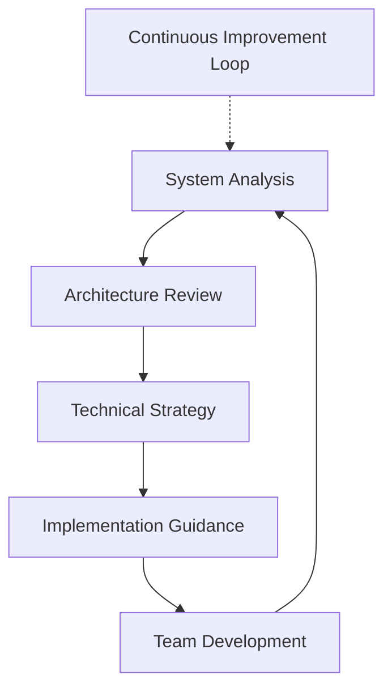

# About Mike Shogin 1

## WhoAmI

```bash
$ whoami
mike.shogin
$ cat /etc/profile
# System Analyst & IT Architect
# Location: Remote / Global
# Focus: System Analysis, Architecture, Team Leadership
# Experience: 10+ years in software engineering
```

## Professional Identity

I'm a **System Analyst and IT Architect** who helps engineering teams and organizations build better systems through strategic analysis, architectural guidance, and technical leadership. My approach combines deep technical knowledge with business understanding to deliver practical, sustainable solutions.

### Core Competencies

```yaml
technical_skills:
  - system_analysis
  - architecture_design
  - performance_optimization
  - technical_debt_assessment
  - security_auditing

leadership_skills:
  - technical_mentorship
  - team_scaling
  - process_optimization
  - strategic_planning
  - stakeholder_communication

domains:
  - web_applications
  - microservices
  - distributed_systems
  - cloud_infrastructure
  - data_architecture
```

## Technical Philosophy

### Principles

> **Clarity over Complexity**  
> Simple solutions that work are better than complex ones that don't.

> **Sustainable Growth**  
> Building systems and teams that can evolve with business needs.

> **Evidence-Based Decisions**  
> Using data and analysis to guide technical choices.

> **Knowledge Transfer**  
> Teaching teams to maintain and improve systems independently.

## Experience Overview

### System Analysis & Architecture
- **10+ years** designing and reviewing system architectures
- **50+ projects** across startups to enterprise environments
- **Multiple domains**: E-commerce, FinTech, SaaS, Enterprise software

### Technical Leadership
- Led architecture decisions for systems serving **10M+ users**
- Managed technical debt reduction projects saving **$2M+ annually**
- Architected cloud migrations reducing infrastructure costs by **40%**

### Team Development
- Mentored **100+ developers** from junior to staff engineer levels
- Helped **20+ engineering managers** transition from IC roles
- Designed onboarding programs reducing time-to-productivity by **60%**

## Current Focus



### Areas of Specialization

| Domain | Focus Areas | Typical Outcomes |
|--------|-------------|------------------|
| **Performance** | Bottleneck analysis, optimization strategies | 40-70% improvement in response times |
| **Scalability** | Architecture design, capacity planning | Support for 10x+ growth without rewrites |
| **Security** | Vulnerability assessment, compliance | Zero critical security incidents |
| **Team Efficiency** | Process optimization, tooling | 30-60% increase in development velocity |

## Technology Stack

### Current Preferences

**Languages**: TypeScript, Python, Go, Java  
**Frameworks**: React, Node.js, Django, Spring Boot  
**Databases**: PostgreSQL, Redis, MongoDB  
**Infrastructure**: AWS, Docker, Kubernetes, Terraform  
**Monitoring**: Prometheus, Grafana, ELK Stack  

### Architecture Patterns

- **Microservices** with event-driven architecture
- **CQRS/Event Sourcing** for complex domains
- **Hexagonal Architecture** for maintainable code
- **Domain-Driven Design** for large systems

## Methodology

### Analysis Framework

1. **Context Discovery** - Understanding business goals and constraints
2. **Current State Assessment** - Technical and process evaluation
3. **Gap Analysis** - Identifying improvement opportunities
4. **Solution Design** - Architecture and implementation planning
5. **Roadmap Creation** - Phased approach with clear milestones
6. **Knowledge Transfer** - Ensuring team independence

### Consulting Approach

```python
def analyze_system(context):
    """
    Systematic approach to system analysis
    """
    discovery = gather_requirements(context)
    assessment = evaluate_current_state(discovery)
    gaps = identify_opportunities(assessment)
    solutions = design_improvements(gaps)
    roadmap = create_implementation_plan(solutions)
    
    return deliver_with_knowledge_transfer(roadmap)
```

## Contact & Collaboration

### Preferred Communication

- **Technical Discussions**: In-depth architecture reviews
- **Strategic Planning**: Technology roadmap development
- **Problem Solving**: Complex system challenges
- **Mentorship**: Career development and technical growth

### Availability

- **Consulting**: Strategic engagements (1-6 months)
- **Mentorship**: Individual and team programs
- **Advisory**: Ongoing technical guidance
- **Speaking**: Technical conferences and workshops

---

## Let's Connect

```bash
# Get in touch for technical discussions
curl -X POST https://mikeshogin.com/contact \
  -H "Content-Type: application/json" \
  -d '{
    "subject": "Technical Consultation",
    "message": "Let'\''s discuss your architecture challenges"
  }'
```

**Email**: [contact@mikeshogin.com](mailto:contact@mikeshogin.com)  
**LinkedIn**: [linkedin.com/in/mikeshogin](https://linkedin.com/in/mikeshogin)  
**GitHub**: [github.com/mikeshogin](https://github.com/mikeshogin)

*Ready to optimize your systems and scale your team? Let's explore how strategic analysis and technical expertise can accelerate your growth.* 
