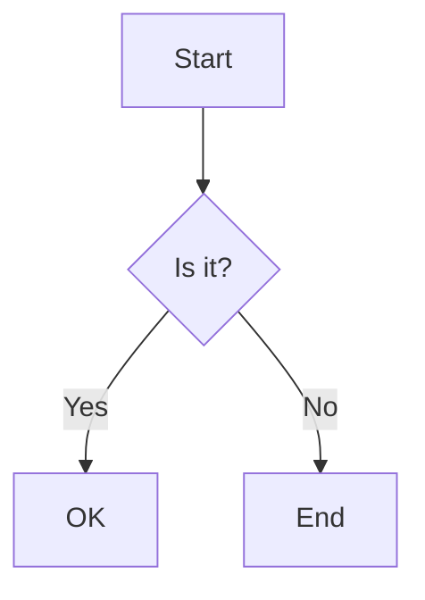
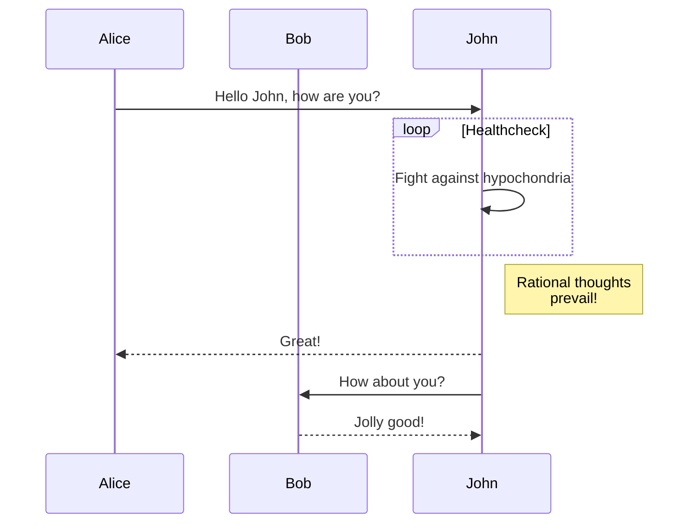
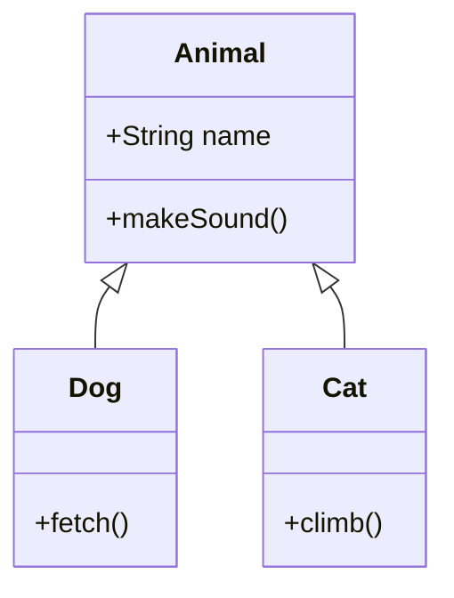
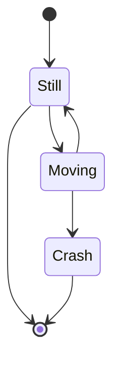
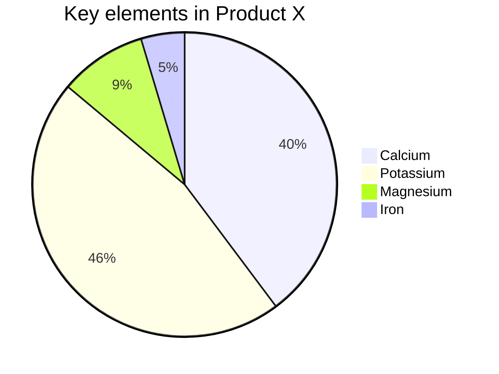

# Diagrams

## Flowchart Example

```mermaid
graph TD
    A[Start] --> B{Is it?}
    B -- Yes --> C[OK]
    B -- No --> D[End]
```

## Sequence Diagram Example

```mermaid
sequenceDiagram
    participant Alice
    participant Bob
    Alice->>John: Hello John, how are you?
    loop Healthcheck
        John->>John: Fight against hypochondria
    end
    Note right of John: Rational thoughts <br/>prevail!
    John-->>Alice: Great!
    John->>Bob: How about you?
    Bob-->>John: Jolly good!
```

## Class Diagram Example

```mermaid
classDiagram
    class Animal {
        +String name
        +makeSound()
    }
    class Dog {
        +fetch()
    }
    class Cat {
        +climb()
    }
    Animal <|-- Dog
    Animal <|-- Cat
```

## State Diagram Example

```mermaid
stateDiagram-v2
    [*] --> Still
    Still --> [*]
    Still --> Moving
    Moving --> Still
    Moving --> Crash
    Crash --> [*]
```

## Pie Chart Example

```mermaid
pie
    title Key elements in Product X
    "Calcium" : 42.96
    "Potassium" : 50.05
    "Magnesium" : 10.01
    "Iron" :  5
``` 