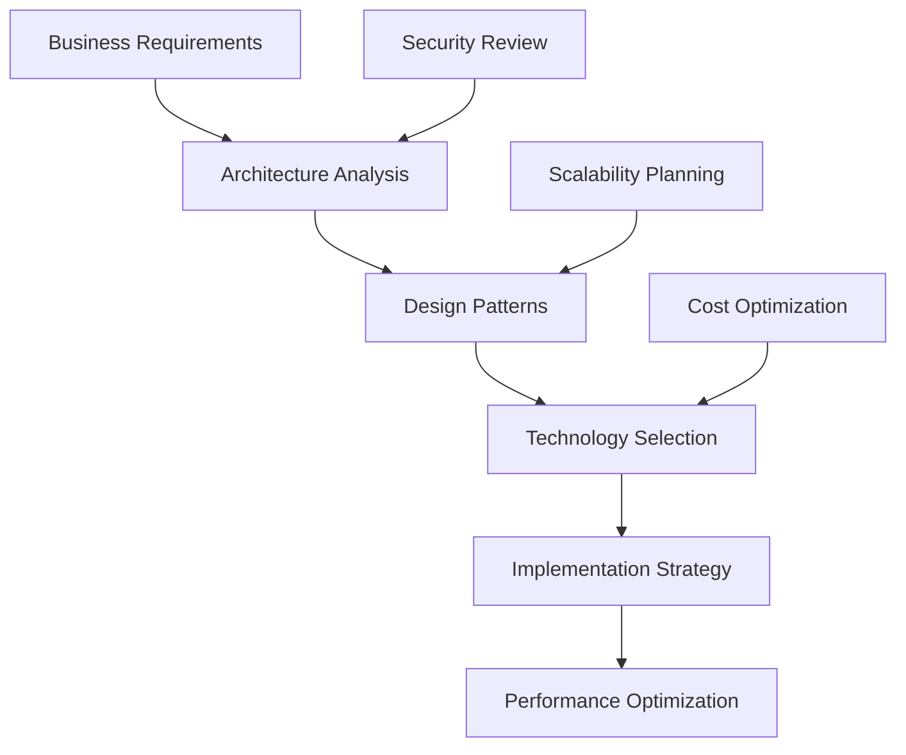
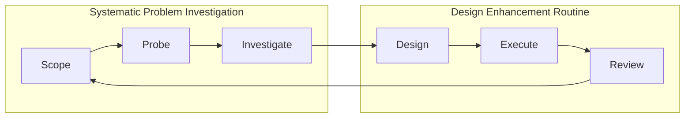
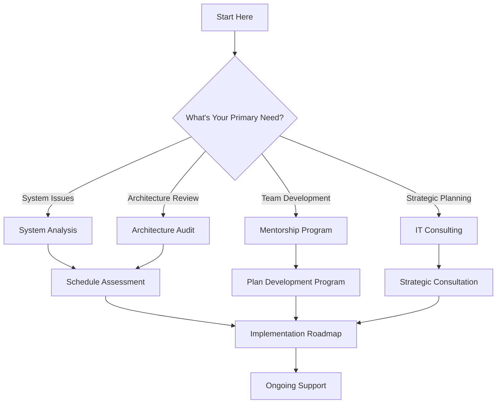

# Welcome to Mike Shogin's Technical Hub

## System Analyst & IT Architect

```bash
$ whoami
mike.shogin
$ cat /etc/role
# System Analyst & IT Architect
# Mission: Building better systems through strategic analysis
# Approach: Data-driven, methodical, business-focused
# Impact: Scalable solutions that drive real value
```

## Professional Overview

I'm a **System Analyst and IT Architect** who helps engineering teams and organizations build better systems through strategic analysis, architectural guidance, and technical leadership. My approach combines deep technical expertise with strategic business understanding to deliver solutions that drive real value.

### What I Do

```yaml
core_services:
  system_analysis:
    focus: "Methodical examination of technical infrastructure"
    outcome: "Optimization opportunities and strategic roadmaps"
    
  architecture_design:
    focus: "Scalable, maintainable system architectures"
    outcome: "Future-proof technical foundations"
    
  technical_leadership:
    focus: "Team development and process optimization"
    outcome: "High-performing engineering organizations"
    
  strategic_consulting:
    focus: "Technology strategy aligned with business goals"
    outcome: "Competitive advantage through technology"
```

## Service Portfolio

### 🔍 System Analysis & Requirements Engineering

**Transform business challenges into technical solutions**

```python
def system_analysis_process():
    return {
        'discovery': [
            'stakeholder_interviews',
            'current_state_assessment', 
            'pain_point_identification',
            'opportunity_analysis'
        ],
        'analysis': [
            'requirements_gathering',
            'process_mapping',
            'data_flow_analysis',
            'integration_assessment'
        ],
        'design': [
            'solution_architecture',
            'implementation_roadmap',
            'risk_mitigation_strategy'
        ]
    }
```

**[Learn More About System Analysis →](/services/system-analysis)**

---

### 🏗️ Architecture Design & Review

**Design scalable, maintainable system architectures**



**Key Specializations:**
- **Cloud Architecture**: AWS, Azure, GCP migration and optimization
- **Microservices**: Monolith decomposition and service design
- **Data Architecture**: ETL pipelines, data lakes, analytics platforms
- **Security Architecture**: Zero-trust, compliance, threat modeling

**[Explore Architecture Services →](/services/architecture-audit)**

---

### 👨‍🏫 Mentorship & Technical Coaching

**Accelerate your team's technical and analytical capabilities**

```yaml
mentorship_programs:
  individual_coaching:
    - personalized_skill_development
    - career_advancement_planning
    - technical_leadership_training
    
  team_development:
    - high_performing_team_building
    - process_optimization
    - knowledge_sharing_culture
    
  leadership_transition:
    - ic_to_manager_guidance
    - technical_decision_making
    - stakeholder_communication
```

**[Start Your Growth Journey →](/services/mentorship)**

---

### 💼 Strategic IT Consulting

**Align technology strategy with business objectives**

| Engagement Type | Duration | Best For | Key Deliverables |
|----------------|----------|----------|------------------|
| **Quick Assessment** | 2-4 weeks | Immediate insights | Analysis report + recommendations |
| **Strategic Design** | 4-8 weeks | Solution architecture | Detailed roadmap + implementation plan |
| **Full Implementation** | 3-6 months | End-to-end delivery | Working system + team training |
| **Ongoing Advisory** | Continuous | Strategic guidance | Regular reviews + optimization |

**[Discuss Your Challenges →](/services/consulting)**

## Real-World Impact

### Success Metrics

```yaml
typical_outcomes:
  performance_improvements:
    - system_response_time: "40-70% faster"
    - deployment_frequency: "300-500% increase"
    - defect_reduction: "50-70% fewer issues"
    
  business_impact:
    - time_to_market: "25-40% faster"
    - operational_costs: "20-35% reduction"
    - team_productivity: "30-50% increase"
    - customer_satisfaction: "15-25% improvement"
```

### Featured Case Studies

**🚀 E-commerce Platform Transformation**
- **Challenge**: Legacy monolith struggling with scale
- **Solution**: Microservices architecture with event-driven integration
- **Results**: 5x deployment frequency, 40% performance improvement, $2M annual savings

**🏦 Financial Services Modernization**
- **Challenge**: Regulatory compliance and system integration
- **Solution**: Event sourcing architecture with comprehensive audit trails
- **Results**: 100% compliance, 90% faster audit preparation, real-time fraud detection

**[View Complete Portfolio →](/portfolio)**

## Technology Expertise

### Current Tech Stack

```python
def technology_expertise():
    return {
        'languages': {
            'primary': ['Python', 'TypeScript', 'Java', 'Go'],
            'secondary': ['C#', 'Rust', 'Scala', 'SQL']
        },
        'cloud_platforms': {
            'aws': ['EC2', 'Lambda', 'RDS', 'S3', 'EKS'],
            'azure': ['App Service', 'Functions', 'AKS'],
            'gcp': ['Compute Engine', 'Cloud Functions', 'GKE']
        },
        'architecture_patterns': [
            'microservices',
            'event_driven_architecture', 
            'domain_driven_design',
            'cqrs_event_sourcing'
        ]
    }
```

### Methodology: SPIDER Framework



**SPIDER** - *Systematic Problem Investigation and Design Enhancement Routine*
- **S**cope: Define boundaries and objectives
- **P**robe: Deep dive investigation and analysis
- **I**nvestigate: Root cause analysis and research
- **D**esign: Solution architecture and planning
- **E**xecute: Implementation and delivery
- **R**eview: Validation and continuous improvement

## Quick Start Guide

### For Technical Leaders

```bash
# Strategic technology planning
$ assess_current_architecture --scope="enterprise"
$ design_migration_strategy --target="cloud_native"
$ optimize_team_processes --focus="velocity"
```

**Focus Areas:**
- Technology roadmap development
- Architecture review and optimization
- Team scaling and process improvement
- Technical debt assessment and remediation

### For Engineering Teams

```bash
# System optimization
$ analyze_performance_bottlenecks --depth="comprehensive"
$ review_code_quality --standards="enterprise"
$ implement_best_practices --domain="your_stack"
```

**Focus Areas:**
- Performance optimization and scalability planning
- Development process improvement
- Code quality and maintainability enhancement
- Knowledge transfer and skill development

### For Individual Contributors

```bash
# Career development
$ plan_career_growth --target_role="senior_engineer"
$ develop_technical_skills --focus="system_design"
$ prepare_leadership_transition --timeline="6_months"
```

**Focus Areas:**
- Career advancement guidance and mentorship
- Technical skill development programs
- Leadership transition support
- System design and architecture training

## Getting Started

### Choose Your Path



### Engagement Process

1. **Initial Consultation** (Free 30-min call)
   - Understand your challenges and goals
   - Assess current state and priorities
   - Recommend optimal engagement approach

2. **Detailed Assessment** (1-2 weeks)
   - Comprehensive analysis of current systems
   - Stakeholder interviews and requirements gathering
   - Gap analysis and opportunity identification

3. **Solution Design** (2-4 weeks)
   - Architecture design and technology selection
   - Implementation roadmap with clear milestones
   - Risk assessment and mitigation strategies

4. **Implementation Support** (Ongoing)
   - Hands-on guidance and technical leadership
   - Team training and knowledge transfer
   - Continuous optimization and improvement

## Ready to Get Started?

```bash
# Begin your transformation journey
curl -X POST https://mikeshogin.com/contact \
  -H "Content-Type: application/json" \
  -d '{
    "service": "Initial Consultation",
    "message": "Let'\''s discuss your system architecture challenges",
    "urgency": "this_quarter"
  }'
```

### Next Steps

- **[📧 Schedule Free Consultation →](mailto:contact@mikeshogin.com?subject=Free%20Consultation%20Request)**
- **[📊 Explore Services in Detail →](/services)**
- **[💼 Review Portfolio Examples →](/portfolio)**
- **[📚 Access Resources & Insights →](/resources)**

---

## Connect & Collaborate

**Email**: [contact@mikeshogin.com](mailto:contact@mikeshogin.com)  
**LinkedIn**: [linkedin.com/in/mikeshogin](https://linkedin.com/in/mikeshogin)  
**Languages**: English

> *"Building better systems through strategic analysis, practical solutions, and knowledge transfer."*

---

*Ready to optimize your systems and scale your team? Let's explore how strategic analysis and technical expertise can accelerate your growth.*
