```mermaid
flowchart LR
    A[🏳️ Product<br/>challenges] --> B[🗂️ Structured<br/>solutions] --> C[📄 Clear<br/>documentation]

    classDef boxStyle fill:#f9f9f9,stroke:#ccc,stroke-width:1px,rx:8,ry:8;
    class A,B,C boxStyle;
```

**I bring clarity to complex systems.**  
Through system analysis, architecture, and AI-driven documentation.

---

I help teams think clearer, deliver faster, and feel confident about where they're going.

I work at the intersection of product, architecture, and engineering —  
supporting decisions with documentation, diagrams, and reasoning, not guesswork.

---

From chaos to clarity

---

## What you'll find here

- **[Services](/services)** — System analysis, architectural support, AI workflows, and consulting.
- **[AI Engineering](/services)** — How I use AI to document systems, support analysts, and scale architectural thinking.
- **[Blog](/blog)** — Notes, articles, and thinking tools.
- **[Portfolio](/portfolio)** — Projects I've worked on.

---

## Who I work with

I collaborate with product managers, system analysts, developers, and tech leaders  
who want **alignment**, **faster delivery**, and **less chaos**.

---

> "Architecture is not a diagram. It's how we agree on what matters."

---

If that resonates — feel free to explore. Or just start with [the blog](/blog).

