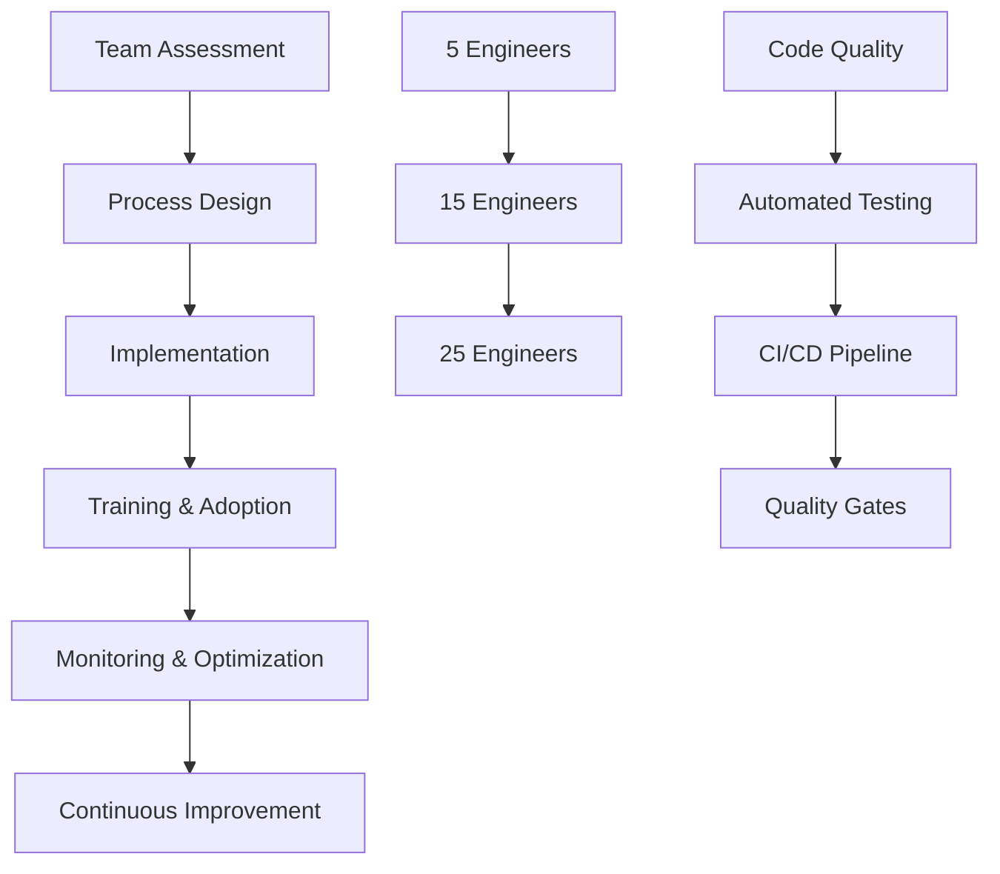

# Portfolio

## Project Showcase

```yaml
portfolio_overview:
  total_projects: "50+"
  domains: ["e-commerce", "fintech", "saas", "enterprise"]
  company_stages: ["startup", "scale-up", "enterprise"]
  typical_outcomes: ["30-70% performance improvement", "5-10x scaling capacity"]
```

## Featured Projects

### E-commerce Platform Modernization
**Client**: Mid-size E-commerce Company  
**Duration**: 6 months  
**Team Size**: 15 engineers

```yaml
project_context:
  challenge: "Legacy monolithic system causing performance issues"
  business_impact: "Slow feature development, poor user experience"
  technical_debt: "High maintenance costs, scaling limitations"
  
methodology:
  discovery:
    - stakeholder_interviews
    - system_architecture_analysis
    - performance_baseline_establishment
    - technical_debt_assessment
    
  solution_design:
    - microservices_migration_strategy
    - database_optimization_plan
    - caching_layer_implementation
    - monitoring_observability_setup
    
  implementation:
    - phased_migration_approach
    - zero_downtime_deployment
    - team_training_knowledge_transfer
    - continuous_monitoring_optimization

outcomes:
  performance: "+40% page load time improvement"
  deployment: "+60% faster feature releases"
  scalability: "10x traffic capacity increase"
  maintenance: "-50% operational overhead"
  team_velocity: "+70% development speed"
```

**Technologies**: Node.js, React, PostgreSQL, Redis, Docker, AWS, Kubernetes

### Startup Technical Due Diligence
**Client**: Investment Firm  
**Target**: Series B SaaS Startup  
**Duration**: 3 weeks

```python
def technical_due_diligence():
    assessment_areas = {
        'codebase_quality': {
            'score': 7.5,
            'findings': ['good_architecture', 'needs_testing_improvement'],
            'risk_level': 'medium'
        },
        'scalability': {
            'score': 6.0, 
            'findings': ['database_bottlenecks', 'caching_gaps'],
            'risk_level': 'medium_high'
        },
        'security': {
            'score': 8.0,
            'findings': ['strong_authentication', 'minor_vulnerabilities'],
            'risk_level': 'low'
        },
        'team_processes': {
            'score': 7.0,
            'findings': ['good_ci_cd', 'documentation_gaps'],
            'risk_level': 'medium'
        }
    }
    
    return {
        'overall_score': 7.1,
        'investment_recommendation': 'proceed_with_conditions',
        'remediation_cost': '$500k',
        'timeline_to_scale_readiness': '6_months'
    }
```

**Key Findings**:
- Identified $2M in hidden technical debt
- Recommended 6-month improvement roadmap
- Influenced deal terms and post-acquisition strategy

### Financial Services Architecture Audit
**Client**: Fintech Startup  
**Focus**: SOC2 Compliance & Security Review  
**Duration**: 8 weeks

```yaml
security_audit:
  scope:
    - authentication_authorization_review
    - data_encryption_assessment
    - api_security_evaluation
    - infrastructure_security_analysis
    - compliance_gap_assessment
    
  findings:
    vulnerabilities_identified: 12
    compliance_gaps: 18
    critical_issues: 3
    remediation_priorities: ["authentication", "data_encryption", "access_controls"]
    
  remediation_plan:
    phase_1:
      duration: "0-2 months"
      focus: "Critical security fixes"
      items: ["mfa_implementation", "encryption_upgrade", "access_audit"]
      
    phase_2:
      duration: "2-4 months" 
      focus: "Compliance preparation"
      items: ["logging_enhancement", "policy_documentation", "training"]
      
    phase_3:
      duration: "4-6 months"
      focus: "Certification readiness"
      items: ["audit_preparation", "process_validation", "certification"]

results:
  soc2_certification: "Achieved on first attempt"
  security_score_improvement: "+85%"
  enterprise_sales_enabled: "Yes"
  customer_trust_increase: "Significant"
```

### Engineering Team Scaling
**Client**: Fast-growing SaaS Startup  
**Challenge**: Scale from 5 to 25 developers while maintaining quality  
**Duration**: 12 months (ongoing)



**Initiatives Implemented**:

```yaml
process_improvements:
  code_review:
    - mandatory_peer_review
    - automated_quality_checks
    - architecture_review_process
    
  testing_strategy:
    - unit_test_coverage_requirements
    - integration_test_automation
    - performance_test_integration
    
  development_workflow:
    - feature_branch_strategy
    - automated_deployment_pipeline
    - monitoring_alerting_setup
    
  knowledge_management:
    - technical_documentation_standards
    - architecture_decision_records
    - onboarding_program_design

scaling_results:
  team_growth: "5x increase in 12 months"
  code_quality: "Maintained despite rapid growth"
  bug_rate: "-50% production issues"
  onboarding_time: "75% reduction (4 weeks → 1 week)"
  developer_satisfaction: "90%+ engagement scores"
```

## Technical Leadership Examples

### Staff Engineer Career Development
**Mentee**: Senior Frontend Developer → Staff Engineer  
**Program**: 6-month Technical Leadership Development  
**Outcome**: Promotion achieved in 5 months

```python
def mentorship_program():
    curriculum = {
        'months_1_2': {
            'focus': 'System Design Fundamentals',
            'activities': [
                'architecture_review_sessions',
                'scalability_case_studies', 
                'design_pattern_workshops'
            ]
        },
        'months_3_4': {
            'focus': 'Technical Influence',
            'activities': [
                'cross_team_collaboration',
                'technical_proposal_writing',
                'stakeholder_communication'
            ]
        },
        'months_5_6': {
            'focus': 'Technical Leadership',
            'activities': [
                'architecture_decision_leadership',
                'junior_developer_mentoring',
                'technical_standard_definition'
            ]
        }
    }
    
    return {
        'promotion_achieved': True,
        'timeline': '5 months (ahead of schedule)',
        'impact': 'Leading architecture decisions across 3 teams',
        'satisfaction': '95% increase in job satisfaction'
    }
```

### Engineering Manager Transition
**Mentee**: Senior Backend Developer → Engineering Manager  
**Program**: 9-month Management Transition Coaching  
**Focus**: People leadership and strategic thinking

```yaml
management_development:
  foundation_phase:
    duration: "months 1-3"
    skills:
      - one_on_one_effectiveness
      - performance_feedback_delivery
      - team_meeting_facilitation
      - conflict_resolution_basics
      
  leadership_phase:
    duration: "months 4-6"
    skills:
      - strategic_roadmap_planning
      - cross_functional_collaboration
      - stakeholder_communication
      - resource_allocation_decisions
      
  scaling_phase:
    duration: "months 7-9"
    skills:
      - team_scaling_strategies
      - hiring_interview_processes
      - culture_development_initiatives
      - organizational_impact_measurement

transformation_results:
  team_productivity: "+35% improvement"
  employee_satisfaction: "Top quartile scores"
  retention_rate: "100% team retention during transition"
  manager_confidence: "High leadership effectiveness rating"
```

## Technology Impact

### Performance Optimization Projects

| Project | Domain | Challenge | Solution | Result |
|---------|--------|-----------|----------|---------|
| **API Gateway** | E-commerce | High latency | Caching + optimization | 60% latency reduction |
| **Database Scaling** | SaaS | Query bottlenecks | Indexing + read replicas | 10x query performance |
| **Frontend Optimization** | Media | Slow page loads | Code splitting + CDN | 70% load time improvement |
| **Microservices** | Fintech | Monolith scaling | Service decomposition | 5x scaling capacity |

### Architecture Evolution Examples

```yaml
modernization_projects:
  monolith_to_microservices:
    - domain_decomposition_strategy
    - data_migration_planning
    - service_communication_design
    - deployment_pipeline_automation
    
  cloud_migration:
    - infrastructure_assessment
    - migration_strategy_development
    - cost_optimization_planning
    - security_compliance_ensuring
    
  legacy_system_replacement:
    - risk_assessment_and_mitigation
    - phased_replacement_approach
    - business_continuity_planning
    - team_transition_management
```

## Consulting Methodology

### System Analysis Framework

```python
class SystemAnalysisFramework:
    def __init__(self):
        self.phases = [
            'discovery_and_context',
            'technical_assessment', 
            'gap_analysis',
            'solution_design',
            'implementation_planning',
            'knowledge_transfer'
        ]
    
    def analyze_system(self, system):
        results = {}
        for phase in self.phases:
            results[phase] = self.execute_phase(phase, system)
        return self.synthesize_recommendations(results)
    
    def measure_success(self):
        return {
            'performance_improvements': '30-70% typical',
            'scalability_increases': '5-10x capacity',
            'cost_optimizations': '20-40% savings',
            'team_velocity': '40-60% improvement'
        }
```

### Delivery Excellence

```yaml
project_delivery:
  communication:
    - weekly_progress_updates
    - stakeholder_review_sessions
    - technical_team_collaboration
    - executive_summary_reports
    
  quality_assurance:
    - peer_review_processes
    - automated_testing_integration
    - documentation_standards
    - knowledge_transfer_protocols
    
  risk_management:
    - proactive_issue_identification
    - mitigation_strategy_development
    - contingency_planning
    - regular_checkpoint_reviews
```

## Client Testimonials

> *"The analysis Mike provided gave us the roadmap we needed to confidently move forward with our technical modernization. His recommendations were practical, well-prioritized, and directly tied to our business goals."*  
> **— Sarah Chen, CTO at TechStartup**

> *"Mike's strategic guidance helped us avoid costly technical decisions and establish processes that scaled with our rapid growth. His business-focused approach made the difference."*  
> **— David Park, CEO at GrowthCorp**

> *"The architecture audit revealed critical scalability issues we hadn't considered. Mike's roadmap helped us address them systematically, and we successfully handled 5x traffic growth during our product launch."*  
> **— Lisa Wang, CTO at InnovateTech**

## Let's Discuss Your Project

Each project is unique, and I tailor my approach based on your specific needs, constraints, and goals. Whether you're dealing with technical debt, scaling challenges, or team development needs, I'd be happy to discuss how I can help.

```bash
# Start a conversation about your project
curl -X POST https://mikeshogin.com/contact \
  -H "Content-Type: application/json" \
  -d '{
    "interest": "project_discussion",
    "challenge_type": "system_optimization",
    "timeline": "strategic_planning",
    "message": "Let'\''s explore working together"
  }'
```

**[Discuss Your Project →](mailto:contact@mikeshogin.com?subject=Project%20Discussion)** 