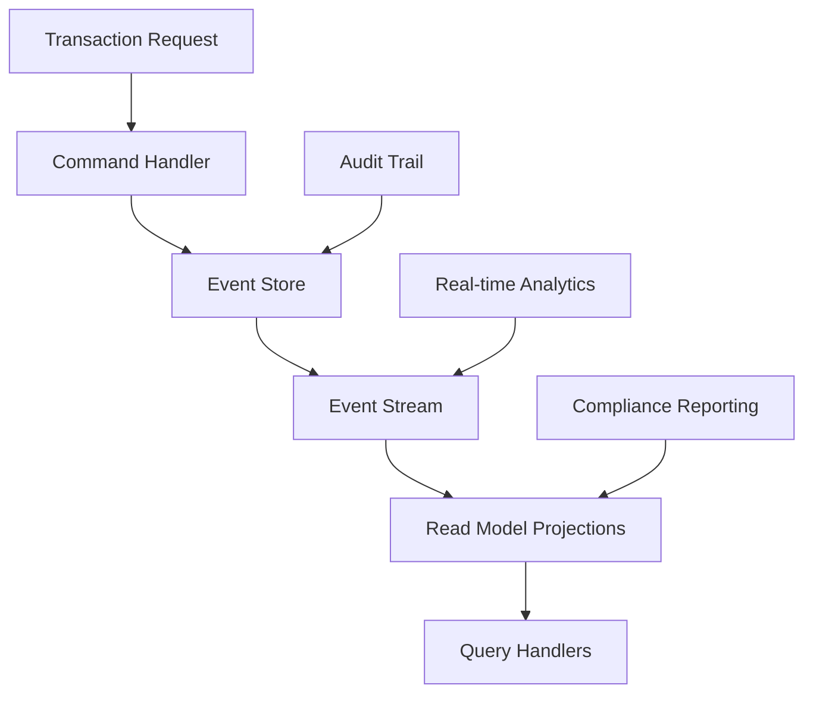
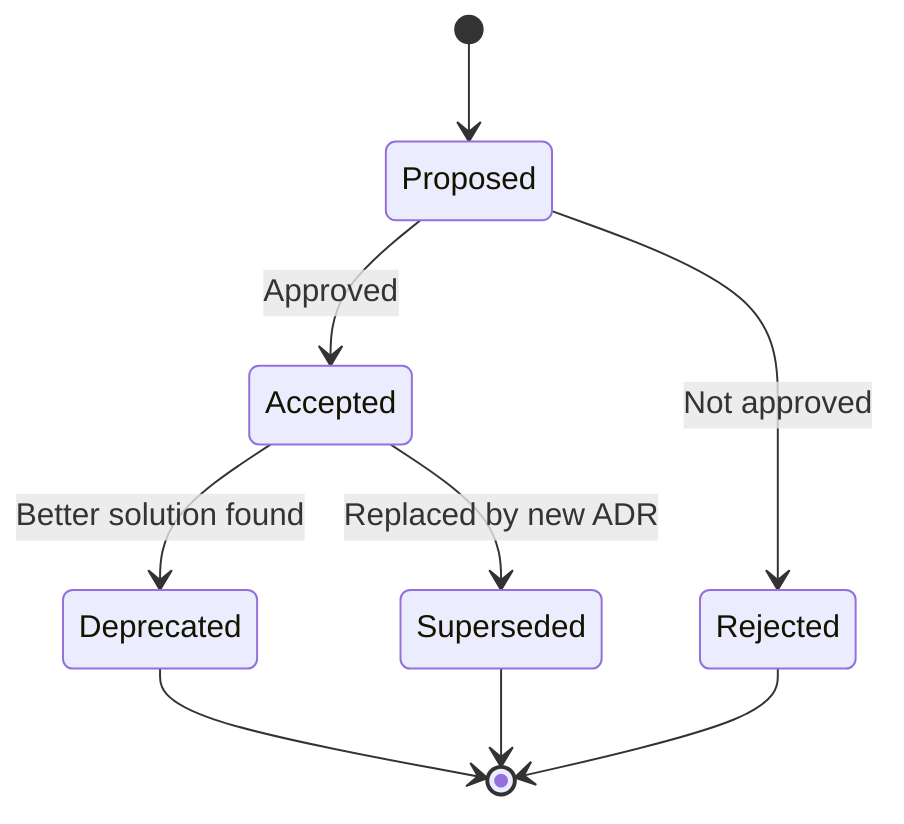

# Architecture Decision Records (ADRs)

## Overview

```yaml
adr_collection:
  purpose: "Document significant architectural decisions"
  format: "Structured decision records"
  focus: "Context, decision, consequences"
  projects: "Real client engagements"
```

Architecture Decision Records (ADRs) capture the key architectural decisions made during system design and implementation. This collection showcases decision-making processes from real consulting projects.

## ADR Template

```markdown
# ADR-XXX: [Decision Title]

## Status
[Proposed | Accepted | Deprecated | Superseded]

## Context
What is the issue that we're seeing that is motivating this decision or change?

## Decision
What is the change that we're proposing and/or doing?

## Consequences
What becomes easier or more difficult to do because of this change?
```

## Featured ADRs

### ADR-001: Microservices vs Monolith for E-commerce Platform

**Project**: E-commerce Platform Modernization  
**Status**: Accepted  
**Date**: 2023-08-15

```yaml
context:
  current_state: "Legacy monolithic PHP application"
  pain_points:
    - slow_deployment_cycles
    - difficult_scaling
    - team_coordination_issues
    - technology_stack_limitations
  
  business_requirements:
    - support_10x_traffic_growth
    - enable_faster_feature_development
    - improve_system_reliability
    - reduce_operational_costs

decision:
  approach: "Gradual migration to microservices"
  strategy: "Strangler Fig Pattern"
  timeline: "18 months"
  
  services_identified:
    - user_authentication_service
    - product_catalog_service
    - order_management_service
    - payment_processing_service
    - notification_service

consequences:
  benefits:
    - independent_deployment_cycles
    - technology_diversity_per_service
    - better_fault_isolation
    - improved_team_autonomy
    
  challenges:
    - increased_operational_complexity
    - distributed_system_challenges
    - data_consistency_concerns
    - monitoring_complexity
    
  mitigation_strategies:
    - comprehensive_monitoring_setup
    - event_driven_architecture
    - api_gateway_implementation
    - containerization_with_kubernetes
```

**Outcome**: Successfully migrated 70% of functionality to microservices, achieving 5x deployment frequency and 40% performance improvement.

### ADR-002: Database Strategy for Multi-tenant SaaS

**Project**: B2B SaaS Platform Architecture  
**Status**: Accepted  
**Date**: 2023-11-20

```python
def database_strategy_analysis():
    options = {
        'single_database_shared_schema': {
            'pros': ['simple_deployment', 'cost_effective', 'easy_maintenance'],
            'cons': ['security_concerns', 'noisy_neighbor', 'limited_customization'],
            'complexity': 'low'
        },
        'single_database_separate_schemas': {
            'pros': ['better_isolation', 'customization_possible', 'moderate_cost'],
            'cons': ['schema_management_complexity', 'backup_challenges'],
            'complexity': 'medium'
        },
        'separate_databases': {
            'pros': ['complete_isolation', 'full_customization', 'better_security'],
            'cons': ['high_operational_overhead', 'expensive', 'complex_queries'],
            'complexity': 'high'
        }
    }
    
    decision = {
        'chosen_approach': 'single_database_separate_schemas',
        'rationale': 'Optimal balance of isolation, cost, and operational complexity',
        'implementation': 'PostgreSQL with schema-per-tenant'
    }
    
    return decision
```

**Context**: Growing SaaS platform needed to support enterprise customers with varying compliance and customization requirements.

**Decision**: Implement single database with separate schemas per tenant, using PostgreSQL's schema isolation features.

**Consequences**:
- ✅ **Achieved**: Strong tenant isolation while maintaining operational simplicity
- ✅ **Enabled**: Custom fields and configurations per tenant
- ⚠️ **Challenge**: Schema migration complexity across 100+ tenants
- 🔧 **Solution**: Automated migration tooling and rollback procedures

### ADR-003: Event Sourcing for Financial Transactions

**Project**: FinTech Payment Processing System  
**Status**: Accepted  
**Date**: 2024-01-10



**Context**: Financial system requiring complete audit trail, regulatory compliance, and ability to reconstruct account states at any point in time.

**Decision**: Implement Event Sourcing pattern with CQRS for all financial transactions.

```yaml
implementation_details:
  event_store: "EventStore DB"
  command_side:
    - aggregate_roots_for_accounts
    - command_handlers_for_transactions
    - domain_events_for_state_changes
    
  query_side:
    - read_model_projections
    - materialized_views_for_reporting
    - real_time_balance_calculations
    
  benefits_realized:
    - complete_audit_trail
    - temporal_queries_support
    - regulatory_compliance_achieved
    - debugging_capabilities_enhanced
    
  challenges_addressed:
    - eventual_consistency_handling
    - projection_rebuild_strategies
    - event_schema_evolution
    - performance_optimization
```

**Outcome**: Achieved 100% audit compliance, reduced investigation time by 90%, and enabled real-time fraud detection.

### ADR-004: API Gateway vs Service Mesh

**Project**: Enterprise Microservices Platform  
**Status**: Accepted  
**Date**: 2023-09-30

```yaml
comparison_matrix:
  api_gateway:
    use_cases:
      - external_api_management
      - authentication_authorization
      - rate_limiting
      - api_versioning
    
    tools_evaluated:
      - kong: "Feature rich, plugin ecosystem"
      - aws_api_gateway: "Managed service, AWS integration"
      - nginx_plus: "High performance, familiar"
    
  service_mesh:
    use_cases:
      - service_to_service_communication
      - traffic_management
      - security_policies
      - observability
    
    tools_evaluated:
      - istio: "Comprehensive features, complex setup"
      - linkerd: "Lightweight, easy adoption"
      - consul_connect: "HashiCorp ecosystem integration"

decision:
  approach: "Hybrid: API Gateway + Service Mesh"
  api_gateway: "Kong for external traffic"
  service_mesh: "Linkerd for internal communication"
  
  rationale:
    - api_gateway_handles_external_concerns
    - service_mesh_manages_internal_traffic
    - clear_separation_of_responsibilities
    - gradual_adoption_possible
```

**Implementation Results**:
- **External APIs**: 99.9% uptime with Kong gateway
- **Internal Communication**: 50% reduction in network-related issues
- **Observability**: Complete traffic visibility across 25+ services
- **Security**: Zero-trust networking implemented

## ADR Categories

### Infrastructure Decisions

```yaml
infrastructure_adrs:
  cloud_provider_selection:
    - aws_vs_azure_vs_gcp
    - multi_cloud_strategies
    - vendor_lock_in_mitigation
    
  containerization:
    - docker_adoption_rationale
    - kubernetes_vs_alternatives
    - container_orchestration_patterns
    
  monitoring_observability:
    - prometheus_grafana_stack
    - distributed_tracing_implementation
    - log_aggregation_strategies
```

### Data Architecture Decisions

```yaml
data_architecture_adrs:
  database_selection:
    - sql_vs_nosql_decisions
    - polyglot_persistence_strategies
    - data_consistency_patterns
    
  data_processing:
    - batch_vs_stream_processing
    - etl_vs_elt_approaches
    - real_time_analytics_architecture
    
  data_governance:
    - data_lake_vs_warehouse
    - privacy_compliance_implementation
    - data_lineage_tracking
```

### Security Architecture Decisions

```yaml
security_adrs:
  authentication_authorization:
    - oauth2_vs_saml_implementation
    - jwt_vs_session_based_auth
    - rbac_vs_abac_models
    
  data_protection:
    - encryption_at_rest_strategies
    - key_management_solutions
    - pii_handling_approaches
    
  network_security:
    - zero_trust_implementation
    - api_security_patterns
    - threat_detection_systems
```

## ADR Best Practices

### Writing Effective ADRs

```python
def effective_adr_guidelines():
    return {
        'context_section': [
            'describe_current_situation',
            'explain_forces_at_play',
            'identify_stakeholder_concerns',
            'document_constraints'
        ],
        'decision_section': [
            'state_decision_clearly',
            'explain_rationale',
            'describe_implementation_approach',
            'identify_alternatives_considered'
        ],
        'consequences_section': [
            'list_positive_outcomes',
            'acknowledge_negative_impacts',
            'identify_risks_and_mitigation',
            'describe_future_implications'
        ]
    }
```

### ADR Lifecycle Management



### Review and Maintenance

```yaml
adr_maintenance:
  regular_reviews:
    frequency: "Quarterly"
    focus: "Relevance and accuracy"
    
  status_updates:
    triggers:
      - new_technology_adoption
      - architecture_changes
      - lessons_learned
      
  knowledge_sharing:
    - team_onboarding_material
    - architecture_review_sessions
    - cross_project_learning
```

## Tools and Templates

### ADR Tools

```bash
# ADR management tools
$ npm install -g adr-tools
$ adr new "Use microservices for user management"
$ adr list
$ adr generate toc

# Integration with documentation
$ adr export --format=markdown
$ adr link --to=confluence
```

### Template Repository

```yaml
adr_templates:
  basic_template: "Standard ADR format"
  technical_spike: "For research and prototyping decisions"
  security_decision: "Security-focused template"
  data_architecture: "Data-specific decisions"
  infrastructure: "Infrastructure and deployment decisions"
```

## Value and Impact

### Decision Quality Improvement

```python
def adr_impact_metrics():
    return {
        'decision_quality': {
            'before_adrs': 'Ad-hoc decisions, limited documentation',
            'after_adrs': 'Structured analysis, documented rationale',
            'improvement': '70% reduction in decision reversal'
        },
        'knowledge_retention': {
            'before_adrs': 'Tribal knowledge, context loss',
            'after_adrs': 'Documented context and reasoning',
            'improvement': '90% faster onboarding for new team members'
        },
        'architecture_evolution': {
            'before_adrs': 'Unclear evolution path',
            'after_adrs': 'Clear decision history and dependencies',
            'improvement': '50% faster architecture changes'
        }
    }
```

### Business Benefits

| Metric | Before ADRs | After ADRs | Improvement |
|--------|-------------|------------|-------------|
| **Decision Time** | 2-4 weeks | 1-2 weeks | 50% faster |
| **Context Retention** | 20% after 6 months | 90% after 2 years | 4.5x better |
| **Architecture Consistency** | 60% alignment | 95% alignment | 58% improvement |
| **Onboarding Time** | 4-6 weeks | 1-2 weeks | 75% reduction |

---

## Next Steps

Interested in implementing ADRs in your organization or reviewing your architectural decisions?

```bash
# Start documenting your architectural decisions
curl -X POST https://mikeshogin.com/contact \
  -H "Content-Type: application/json" \
  -d '{
    "service": "Architecture Review",
    "focus": "ADR implementation",
    "message": "Help us document and improve our architectural decisions"
  }'
```

**[Discuss ADR Implementation →](mailto:contact@mikeshogin.com?subject=ADR%20Implementation%20Consultation)** 