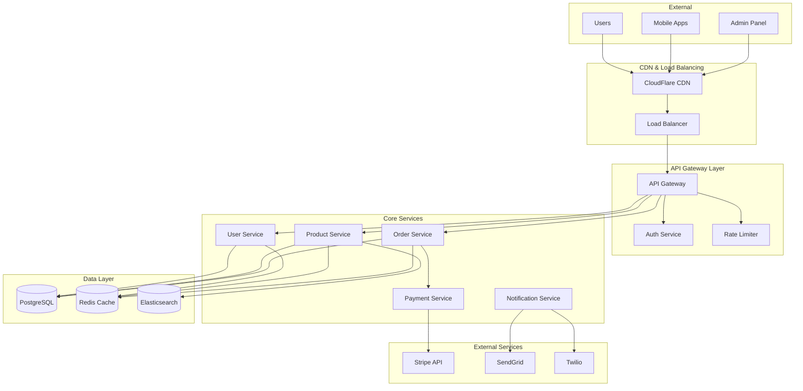
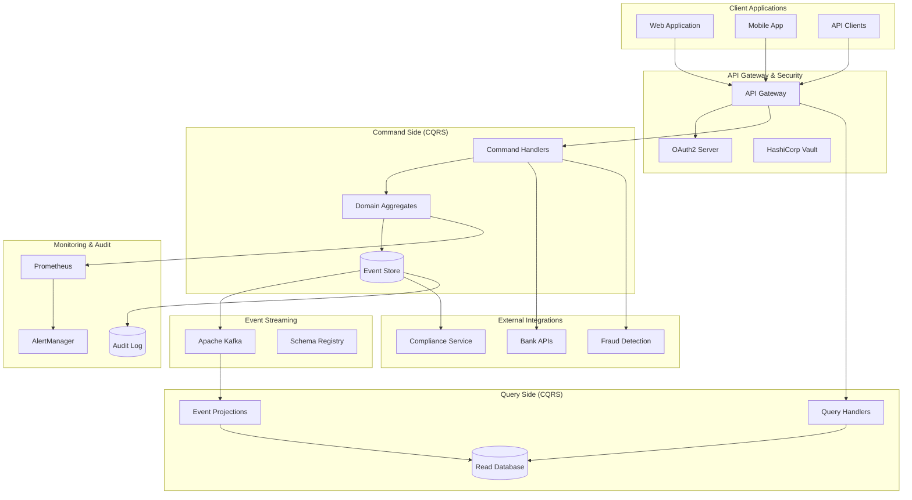
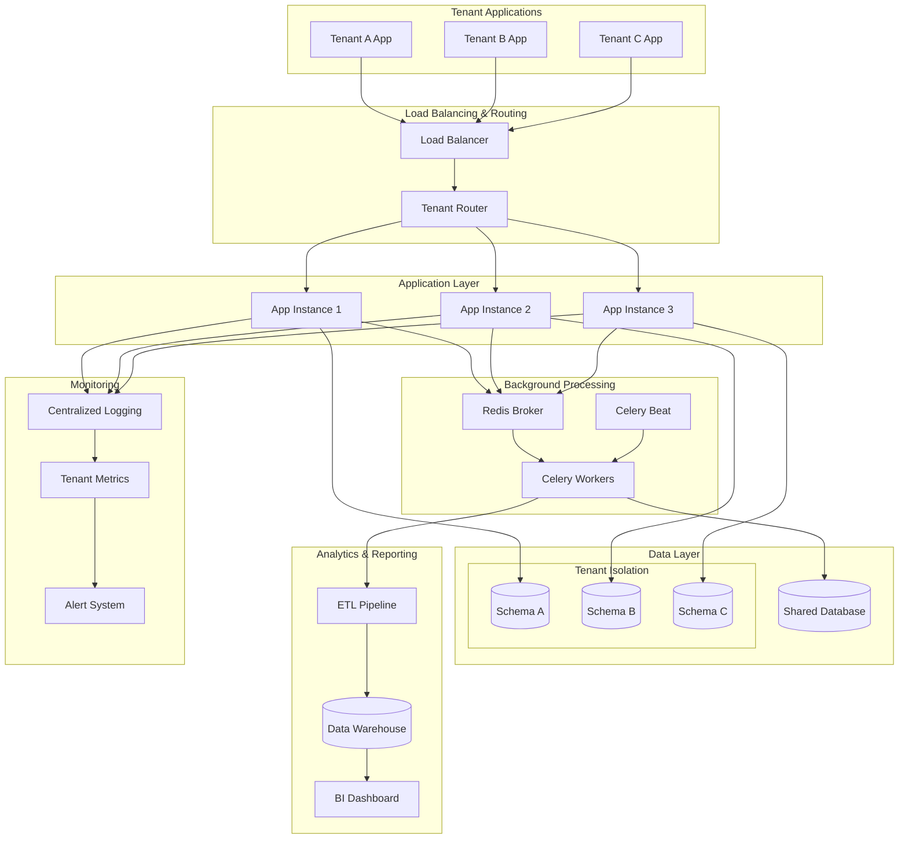
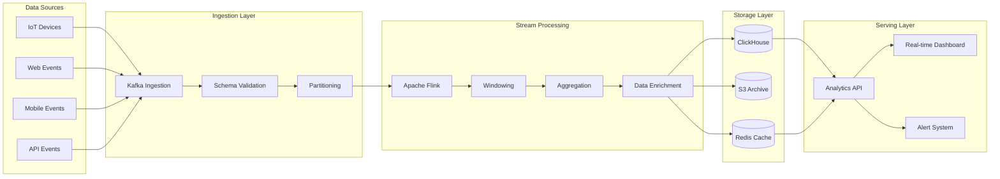
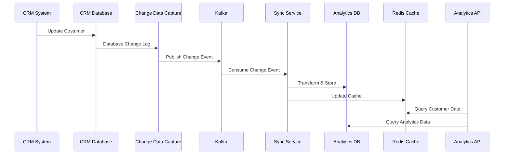
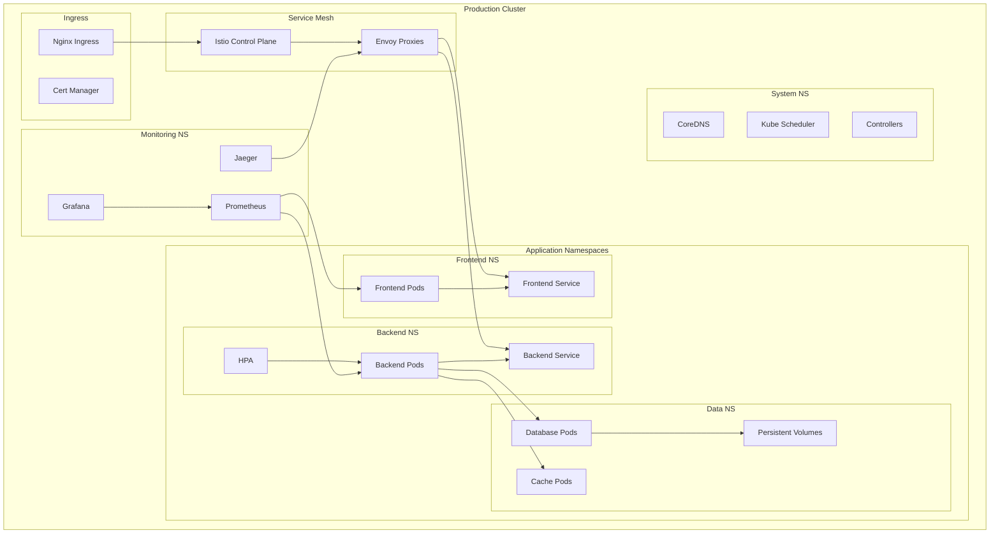
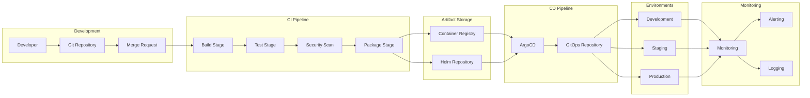
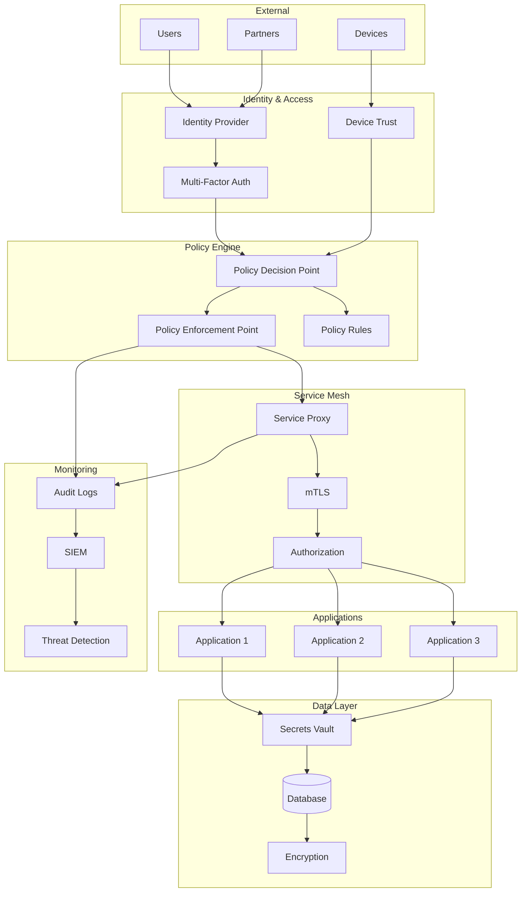
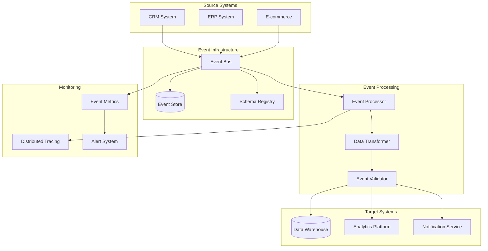

# Architecture Diagrams

## Overview

```yaml
diagram_collection:
  purpose: "Visual system architecture documentation"
  formats: ["mermaid", "c4_model", "uml", "flowcharts"]
  focus: "Real project architectures"
  complexity_levels: ["high_level", "detailed", "implementation"]
```

Visual documentation is crucial for understanding complex systems. This collection showcases architectural diagrams from real consulting projects, demonstrating different visualization techniques and abstraction levels.

## System Architecture Diagrams

### E-commerce Platform Architecture

**Project**: Microservices Migration  
**Scale**: 10M+ users, 50+ services  
**Technology**: Node.js, React, PostgreSQL, Redis, Kubernetes



**Key Design Decisions**:
- **API Gateway**: Single entry point for all client requests
- **Service Isolation**: Each service owns its data and business logic
- **Caching Strategy**: Redis for session data and frequently accessed content
- **Search**: Elasticsearch for product catalog search and analytics

### FinTech Payment Processing System

**Project**: Event-Driven Financial Platform  
**Compliance**: PCI DSS, SOX  
**Technology**: Java, Spring Boot, Apache Kafka, PostgreSQL



**Architecture Highlights**:
- **Event Sourcing**: Complete audit trail for all financial transactions
- **CQRS**: Separate read/write models for optimal performance
- **Event Streaming**: Real-time processing with Apache Kafka
- **Security**: Vault for secrets management, comprehensive audit logging

### Multi-Tenant SaaS Platform

**Project**: B2B Analytics Platform  
**Scale**: 500+ tenants, 1TB+ data  
**Technology**: Python, Django, PostgreSQL, Celery, Redis



**Multi-Tenancy Strategy**:
- **Schema-per-Tenant**: Strong data isolation using PostgreSQL schemas
- **Shared Infrastructure**: Cost-effective resource utilization
- **Tenant Routing**: Dynamic routing based on subdomain/headers
- **Background Processing**: Tenant-aware job processing with Celery

## Data Flow Diagrams

### Real-Time Analytics Pipeline

**Project**: IoT Data Processing Platform  
**Volume**: 1M+ events/second  
**Technology**: Apache Kafka, Apache Flink, ClickHouse



### Data Synchronization Flow

**Project**: Multi-System Integration  
**Pattern**: Event-Driven Synchronization  
**Technology**: Apache Kafka, Debezium, PostgreSQL



## Deployment Diagrams

### Kubernetes Deployment Architecture

**Project**: Microservices Platform  
**Environment**: Multi-region Kubernetes  
**Technology**: Kubernetes, Istio, Prometheus



### CI/CD Pipeline Architecture

**Project**: DevOps Transformation  
**Tools**: GitLab CI, Docker, Kubernetes, ArgoCD



## Security Architecture Diagrams

### Zero Trust Network Architecture

**Project**: Enterprise Security Modernization  
**Framework**: Zero Trust  
**Technology**: Istio, OPA, HashiCorp Vault



## Integration Patterns

### Event-Driven Integration

**Project**: Enterprise System Integration  
**Pattern**: Event Sourcing + CQRS  
**Technology**: Apache Kafka, Event Store



## Diagram Best Practices

### Abstraction Levels

```yaml
diagram_levels:
  context_level:
    purpose: "System boundaries and external interactions"
    audience: "Stakeholders, business users"
    detail: "High-level components only"
    
  container_level:
    purpose: "Major building blocks and technology choices"
    audience: "Architects, senior developers"
    detail: "Applications, databases, key technologies"
    
  component_level:
    purpose: "Internal structure of containers"
    audience: "Developers, technical leads"
    detail: "Classes, modules, interfaces"
    
  code_level:
    purpose: "Implementation details"
    audience: "Developers"
    detail: "Classes, methods, relationships"
```

### Diagram Standards

```python
def diagram_standards():
    return {
        'naming_conventions': {
            'components': 'PascalCase',
            'services': 'kebab-case',
            'databases': 'UPPERCASE',
            'external_systems': 'Title Case'
        },
        'color_coding': {
            'user_interfaces': '#4A90E2',
            'services': '#7ED321',
            'databases': '#F5A623',
            'external_systems': '#D0021B',
            'infrastructure': '#9013FE'
        },
        'layout_principles': [
            'left_to_right_data_flow',
            'group_related_components',
            'minimize_crossing_lines',
            'consistent_spacing'
        ]
    }
```

### Tools and Formats

```yaml
diagram_tools:
  mermaid:
    pros: ["version_controlled", "code_based", "github_integration"]
    cons: ["limited_styling", "complex_layouts_difficult"]
    use_cases: ["documentation", "simple_flows", "sequence_diagrams"]
    
  c4_model:
    pros: ["standardized_approach", "multiple_abstraction_levels"]
    cons: ["learning_curve", "tool_specific"]
    use_cases: ["architecture_documentation", "stakeholder_communication"]
    
  lucidchart:
    pros: ["collaborative", "rich_styling", "templates"]
    cons: ["not_version_controlled", "subscription_cost"]
    use_cases: ["presentations", "complex_diagrams", "workshops"]
    
  draw_io:
    pros: ["free", "web_based", "export_options"]
    cons: ["not_code_based", "collaboration_limitations"]
    use_cases: ["quick_sketches", "detailed_diagrams", "offline_work"]
```

## Value and Impact

### Communication Improvement

```python
def diagram_impact():
    return {
        'stakeholder_alignment': {
            'before': 'Verbal descriptions, misunderstandings',
            'after': 'Visual clarity, shared understanding',
            'improvement': '80% reduction in requirement clarifications'
        },
        'development_speed': {
            'before': 'Unclear architecture, frequent questions',
            'after': 'Clear visual guidance, self-service documentation',
            'improvement': '40% faster onboarding for new developers'
        },
        'decision_making': {
            'before': 'Abstract discussions, unclear trade-offs',
            'after': 'Visual analysis, clear alternatives',
            'improvement': '60% faster architectural decisions'
        }
    }
```

### Documentation Quality

| Aspect | Text-Only | With Diagrams | Improvement |
|--------|-----------|---------------|-------------|
| **Comprehension** | 40% | 85% | +112% |
| **Retention** | 25% | 70% | +180% |
| **Onboarding Time** | 4 weeks | 1.5 weeks | -62% |
| **Architecture Alignment** | 60% | 95% | +58% |

---

## Next Steps

Need help visualizing your system architecture or improving your technical documentation?

```bash
# Request architecture visualization consultation
curl -X POST https://mikeshogin.com/contact \
  -H "Content-Type: application/json" \
  -d '{
    "service": "Architecture Documentation",
    "focus": "diagram_creation",
    "message": "Help us create clear architectural diagrams"
  }'
```

**[Discuss Architecture Visualization →](mailto:contact@mikeshogin.com?subject=Architecture%20Diagram%20Consultation)** 