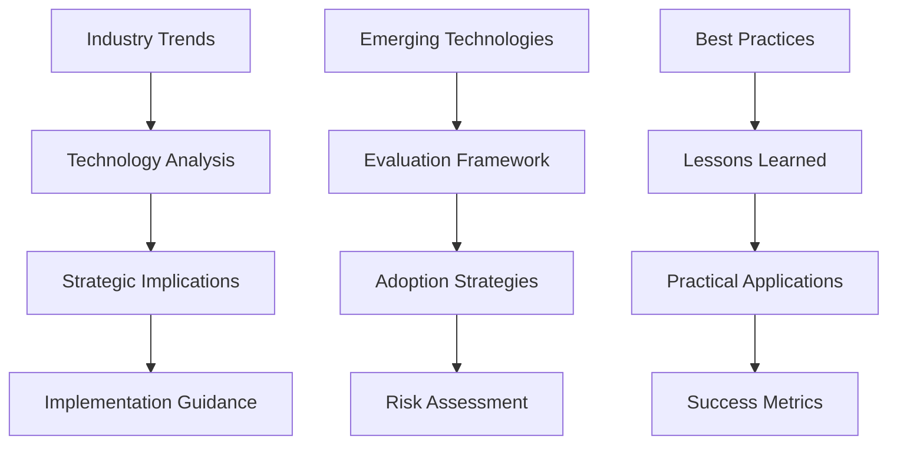
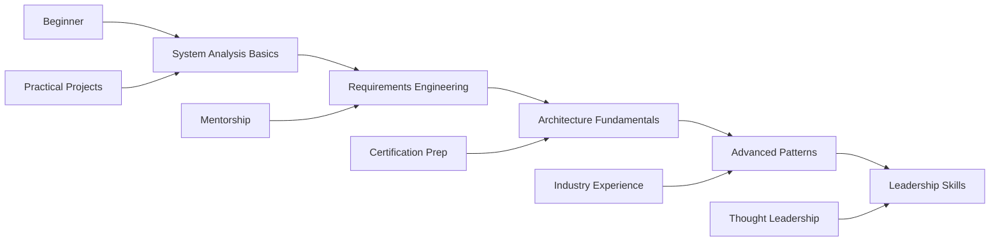

# Resources & Knowledge Hub

## Professional Resources for System Analysts & IT Architects

```yaml
resource_hub:
  purpose: "Knowledge sharing and professional development"
  focus: ["technical_insights", "best_practices", "industry_trends"]
  audience: ["system_analysts", "architects", "technical_leaders"]
  format: ["blog_posts", "case_studies", "templates", "tools"]
```

Welcome to my knowledge hub! Here you'll find curated resources, insights, and practical guidance drawn from years of experience in system analysis, architecture design, and IT consulting. Whether you're looking to solve a specific technical challenge or advance your professional development, these resources are designed to provide actionable value.

## 📚 Knowledge Categories

### 🔍 System Analysis Resources

**Methodologies, frameworks, and practical guides for effective system analysis**

```python
def system_analysis_resources():
    return {
        'methodologies': [
            'SPIDER Framework Guide',
            'Requirements Engineering Best Practices',
            'Stakeholder Analysis Templates',
            'Process Mapping Techniques'
        ],
        'tools_and_templates': [
            'Requirements Traceability Matrix',
            'System Context Diagrams',
            'Use Case Templates',
            'Analysis Checklists'
        ],
        'case_studies': [
            'E-commerce Platform Analysis',
            'Financial System Requirements',
            'Healthcare Integration Study',
            'Legacy System Assessment'
        ]
    }
```

### 🏗️ Architecture Design Resources

**Patterns, principles, and practical guidance for system architecture**

```yaml
architecture_resources:
  design_patterns:
    - microservices_patterns
    - event_driven_architecture
    - domain_driven_design
    - cqrs_event_sourcing
    
  reference_architectures:
    - cloud_native_applications
    - data_intensive_systems
    - real_time_analytics
    - security_first_design
    
  decision_frameworks:
    - technology_selection_criteria
    - architecture_trade_off_analysis
    - scalability_planning_guide
    - performance_optimization_strategies
```

### 💡 Technical Insights & Trends

**Industry analysis, emerging technologies, and strategic perspectives**



## 📝 Latest Blog Posts

### Recent Technical Insights

**[System Analysis Fundamentals: The SPIDER Framework](/blog/system-analysis-fundamentals)**  
*January 15, 2024*

A comprehensive guide to systematic problem investigation and design enhancement. Learn how to apply the SPIDER methodology to complex system analysis challenges.

```yaml
spider_framework:
  S: "Scope - Define boundaries and objectives"
  P: "Probe - Deep dive investigation"
  I: "Investigate - Root cause analysis"
  D: "Design - Solution architecture"
  E: "Execute - Implementation delivery"
  R: "Review - Validation and improvement"
```

**Key Topics Covered:**
- Stakeholder identification and engagement
- Requirements elicitation techniques
- System boundary definition
- Risk assessment methodologies

---

### Coming Soon

**Microservices Migration Strategies**  
*February 2024*

Practical guidance for decomposing monolithic applications into microservices, including patterns, anti-patterns, and real-world case studies.

**Event-Driven Architecture Patterns**  
*March 2024*

Deep dive into event sourcing, CQRS, and event streaming architectures with implementation examples and lessons learned.

**Cloud Architecture Best Practices**  
*April 2024*

Comprehensive guide to designing cloud-native applications with focus on AWS, Azure, and GCP patterns.

## 🛠️ Tools & Templates

### Analysis Templates

```yaml
available_templates:
  requirements_engineering:
    - business_requirements_template
    - functional_requirements_specification
    - non_functional_requirements_checklist
    - requirements_traceability_matrix
    
  system_design:
    - system_context_diagram_template
    - component_interaction_diagrams
    - data_flow_diagram_templates
    - integration_specification_template
    
  project_management:
    - technical_project_charter
    - architecture_review_checklist
    - risk_assessment_matrix
    - stakeholder_analysis_template
```

### Architecture Decision Records (ADRs)

**Structured decision documentation for architectural choices**

```markdown
# ADR Template Structure

## Status
[Proposed | Accepted | Deprecated | Superseded]

## Context
What is the issue that we're seeing that is motivating this decision?

## Decision
What is the change that we're proposing and/or doing?

## Consequences
What becomes easier or more difficult to do because of this change?
```

**Available ADR Examples:**
- Microservices vs Monolith decisions
- Database selection criteria
- API design standards
- Security architecture choices

### Code Examples & Snippets

```python
# System Analysis Utilities
class RequirementsTracker:
    """Track and manage system requirements throughout the project lifecycle"""
    
    def __init__(self):
        self.requirements = {}
        self.traceability_matrix = {}
        
    def add_requirement(self, req_id, description, priority, source):
        self.requirements[req_id] = {
            'description': description,
            'priority': priority,
            'source': source,
            'status': 'draft',
            'test_cases': []
        }
        
    def trace_requirement(self, req_id, design_element, implementation):
        self.traceability_matrix[req_id] = {
            'design': design_element,
            'implementation': implementation,
            'test_coverage': []
        }
```

## 📊 Industry Insights

### Technology Trend Analysis

```yaml
current_trends_2024:
  artificial_intelligence:
    impact: "High"
    adoption_rate: "Accelerating"
    key_areas: ["automation", "decision_support", "predictive_analytics"]
    
  cloud_native_development:
    impact: "Very High"
    adoption_rate: "Mainstream"
    key_areas: ["containerization", "serverless", "microservices"]
    
  edge_computing:
    impact: "Medium"
    adoption_rate: "Growing"
    key_areas: ["iot_processing", "real_time_analytics", "latency_optimization"]
    
  zero_trust_security:
    impact: "High"
    adoption_rate: "Accelerating"
    key_areas: ["identity_verification", "network_segmentation", "continuous_monitoring"]
```

### Market Analysis

**Enterprise Software Trends**

| Technology | Market Growth | Enterprise Adoption | Complexity Level |
|------------|---------------|-------------------|------------------|
| **Kubernetes** | 25% YoY | 78% | High |
| **Serverless** | 35% YoY | 45% | Medium |
| **Event Streaming** | 30% YoY | 52% | High |
| **API Management** | 20% YoY | 85% | Medium |
| **Observability** | 40% YoY | 65% | Medium |

## 🎓 Learning Resources

### Professional Development



### Recommended Reading

**Books for System Analysts & Architects**

```yaml
essential_reading:
  system_analysis:
    - title: "Systems Analysis and Design"
      author: "Dennis, Wixom, Roth"
      focus: "Methodology and best practices"
      
    - title: "Requirements Engineering Fundamentals"
      author: "Pohl, Rupp"
      focus: "Requirements elicitation and management"
      
  architecture:
    - title: "Building Microservices"
      author: "Sam Newman"
      focus: "Microservices design patterns"
      
    - title: "Designing Data-Intensive Applications"
      author: "Martin Kleppmann"
      focus: "Scalable system design"
      
  leadership:
    - title: "The Software Architect Elevator"
      author: "Gregor Hohpe"
      focus: "Technical leadership and communication"
```

### Online Courses & Certifications

**Recommended Learning Paths**

1. **System Analysis Track**
   - Business Analysis Fundamentals
   - Requirements Engineering
   - Process Modeling and Analysis
   - Stakeholder Management

2. **Architecture Track**
   - Solution Architecture Principles
   - Cloud Architecture Patterns
   - Microservices Design
   - Security Architecture

3. **Leadership Track**
   - Technical Leadership
   - Architecture Governance
   - Team Building and Mentoring
   - Strategic Technology Planning

## 🤝 Community & Networking

### Professional Communities

```yaml
recommended_communities:
  online_forums:
    - stackoverflow: "Technical Q&A and problem solving"
    - reddit_systems_design: "Architecture discussions and case studies"
    - linkedin_groups: "Professional networking and insights"
    
  conferences:
    - software_architecture_summit: "Architecture patterns and practices"
    - microservices_conference: "Distributed systems and microservices"
    - devops_enterprise_summit: "DevOps and organizational transformation"
    
  local_meetups:
    - architecture_meetups: "Local architecture communities"
    - agile_user_groups: "Agile and lean practices"
    - technology_specific_groups: "Language and platform communities"
```

### Knowledge Sharing Opportunities

**Ways to Contribute and Learn**

- **Speaking Opportunities**: Conference presentations, meetup talks
- **Writing**: Technical blogs, industry publications
- **Mentoring**: Junior developers, career transitions
- **Open Source**: Contributing to architecture tools and frameworks

## 📞 Get Involved

### Contributing to the Knowledge Hub

```python
def contribute_to_knowledge_hub():
    return {
        'content_types': [
            'guest_blog_posts',
            'case_study_submissions',
            'tool_reviews',
            'template_contributions'
        ],
        'collaboration_opportunities': [
            'joint_research_projects',
            'industry_survey_participation',
            'peer_review_activities',
            'knowledge_sharing_sessions'
        ]
    }
```

### Stay Connected

**Multiple ways to engage and stay updated**

- **📧 Newsletter**: Monthly insights and resource updates
- **💬 Discussion Forum**: Technical discussions and Q&A
- **📱 Social Media**: Follow for daily insights and industry news
- **🎥 Webinars**: Regular deep-dive sessions on technical topics

---

## 🚀 Start Your Learning Journey

Whether you're looking to advance your technical skills, solve specific challenges, or contribute to the community, there's something here for every stage of your professional journey.

```bash
# Explore resources by category
curl -X GET https://mikeshogin.com/api/resources \
  -H "Accept: application/json" \
  -G -d "category=system-analysis" \
  -d "level=intermediate"
```

### Quick Access Links

- **[📝 Latest Blog Posts →](/blog)**
- **[📧 Contact for Collaboration →](mailto:contact@mikeshogin.com?subject=Resource%20Collaboration)**
- **[🔗 Connect on LinkedIn →](https://linkedin.com/in/mikeshogin)**
- **[📚 Download Templates →](#templates)** *(Coming Soon)*

---

*"Knowledge shared is knowledge multiplied. Let's build better systems together."* - Mike Shogin 