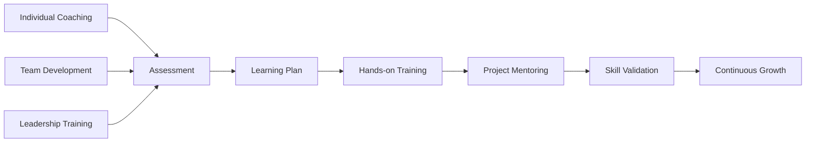
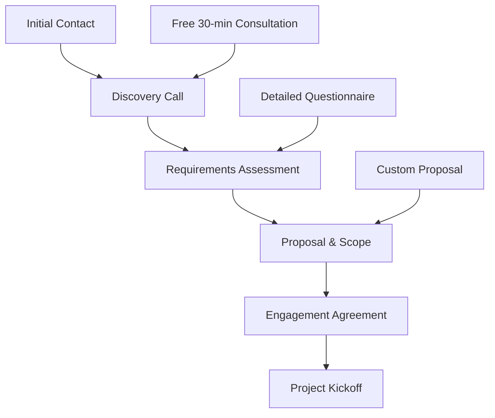

# Services Overview

## Professional IT Consulting & System Analysis

```yaml
service_portfolio:
  focus: "Enterprise system architecture and analysis"
  experience: "15+ years in IT consulting"
  specialization: ["system_analysis", "architecture_design", "digital_transformation"]
  approach: "Data-driven, methodical, business-focused"
```

As a seasoned **System Analyst** and **IT Architect**, I provide comprehensive consulting services that bridge the gap between business requirements and technical implementation. My approach combines deep technical expertise with strategic business understanding to deliver solutions that drive real value.

## Core Service Areas

### 🔍 System Analysis & Requirements Engineering

**Transform business needs into technical specifications**

```python
def system_analysis_process():
    return {
        'discovery_phase': [
            'stakeholder_interviews',
            'current_state_assessment',
            'pain_point_identification',
            'opportunity_analysis'
        ],
        'analysis_phase': [
            'requirements_gathering',
            'process_mapping',
            'data_flow_analysis',
            'integration_assessment'
        ],
        'design_phase': [
            'solution_architecture',
            'technical_specifications',
            'implementation_roadmap',
            'risk_assessment'
        ]
    }
```

**Key Deliverables:**
- Comprehensive requirements documentation
- System architecture blueprints
- Implementation roadmaps
- Risk mitigation strategies

---

### 🏗️ Architecture Design & Review

**Design scalable, maintainable system architectures**

```yaml
architecture_services:
  new_system_design:
    - solution_architecture
    - technology_stack_selection
    - scalability_planning
    - security_architecture
    
  existing_system_audit:
    - architecture_assessment
    - technical_debt_analysis
    - performance_optimization
    - modernization_roadmap
    
  integration_architecture:
    - api_design_strategy
    - data_integration_patterns
    - event_driven_architecture
    - microservices_migration
```

**Specialized Areas:**
- **Cloud Architecture**: AWS, Azure, GCP migration and optimization
- **Microservices**: Monolith decomposition and service design
- **Data Architecture**: ETL pipelines, data lakes, analytics platforms
- **Security Architecture**: Zero-trust, compliance, threat modeling

---

### 👨‍🏫 Mentorship & Technical Coaching

**Develop your team's technical and analytical capabilities**



**Mentorship Programs:**
- **Individual Coaching**: Personalized skill development for analysts and architects
- **Team Development**: Building high-performing technical teams
- **Leadership Training**: Technical leadership and decision-making skills
- **Career Guidance**: Path from developer to architect to technical leader

---

### 💼 Strategic IT Consulting

**Align technology strategy with business objectives**

```yaml
consulting_areas:
  digital_transformation:
    - legacy_system_modernization
    - cloud_migration_strategy
    - process_automation
    - technology_roadmapping
    
  organizational_development:
    - team_structure_optimization
    - technical_process_improvement
    - agile_transformation
    - devops_implementation
    
  technology_strategy:
    - technology_stack_evaluation
    - vendor_selection_support
    - architecture_governance
    - innovation_planning
```

## Service Delivery Approach

### 📋 Methodology: SPIDER Framework

```python
class SPIDERFramework:
    """Systematic Problem Investigation and Design Enhancement Routine"""
    
    def __init__(self):
        self.phases = {
            'S': 'Scope - Define boundaries and objectives',
            'P': 'Probe - Deep dive investigation and analysis', 
            'I': 'Investigate - Root cause analysis and research',
            'D': 'Design - Solution architecture and planning',
            'E': 'Execute - Implementation and delivery',
            'R': 'Review - Validation and continuous improvement'
        }
    
    def execute_engagement(self, project):
        results = {}
        for phase, description in self.phases.items():
            results[phase] = self.execute_phase(phase, project)
        return results
```

### 🎯 Engagement Models

| Model | Duration | Best For | Deliverables |
|-------|----------|----------|--------------|
| **Assessment** | 2-4 weeks | Quick analysis, audit | Report + recommendations |
| **Design Sprint** | 4-8 weeks | Solution design | Architecture + roadmap |
| **Implementation** | 3-6 months | Full project delivery | Working system + documentation |
| **Retainer** | Ongoing | Continuous support | Regular reviews + guidance |

### 📊 Success Metrics

```yaml
engagement_outcomes:
  technical_metrics:
    - system_performance_improvement: "40-60%"
    - deployment_frequency_increase: "300-500%"
    - defect_reduction: "50-70%"
    - technical_debt_reduction: "30-50%"
    
  business_metrics:
    - time_to_market_improvement: "25-40%"
    - operational_cost_reduction: "20-35%"
    - team_productivity_increase: "30-50%"
    - customer_satisfaction_improvement: "15-25%"
```

## Industry Experience

### 🏦 Financial Services
- **Payment Processing Systems**: PCI DSS compliance, fraud detection
- **Banking Platforms**: Core banking modernization, regulatory compliance
- **FinTech Solutions**: Digital wallets, cryptocurrency platforms

### 🛒 E-commerce & Retail
- **Platform Modernization**: Monolith to microservices migration
- **Scalability Solutions**: High-traffic handling, global distribution
- **Integration Platforms**: ERP, CRM, inventory management systems

### 🏥 Healthcare & Life Sciences
- **HIPAA Compliance**: Secure data handling, audit trails
- **Integration Solutions**: EMR systems, lab integrations
- **Analytics Platforms**: Clinical data analysis, reporting systems

### 🏭 Manufacturing & Logistics
- **IoT Platforms**: Sensor data processing, predictive maintenance
- **Supply Chain Systems**: Inventory optimization, tracking systems
- **ERP Modernization**: Legacy system replacement, process automation

## Technology Expertise

### 🔧 Technical Stack

```yaml
programming_languages:
  primary: ["Python", "Java", "JavaScript/TypeScript", "C#"]
  secondary: ["Go", "Rust", "Scala", "SQL"]
  
cloud_platforms:
  aws: ["EC2", "Lambda", "RDS", "S3", "EKS", "API Gateway"]
  azure: ["App Service", "Functions", "SQL Database", "AKS"]
  gcp: ["Compute Engine", "Cloud Functions", "BigQuery", "GKE"]
  
databases:
  relational: ["PostgreSQL", "MySQL", "SQL Server", "Oracle"]
  nosql: ["MongoDB", "Redis", "Elasticsearch", "DynamoDB"]
  
architecture_patterns:
  - microservices_architecture
  - event_driven_architecture
  - domain_driven_design
  - cqrs_event_sourcing
  - api_first_design
```

### 🛠️ Tools & Frameworks

```python
def technology_toolkit():
    return {
        'analysis_tools': [
            'Enterprise Architect', 'Lucidchart', 'Draw.io',
            'JIRA', 'Confluence', 'Miro'
        ],
        'development_frameworks': [
            'Spring Boot', 'Django', 'FastAPI', 'React',
            'Angular', 'Node.js', 'Express'
        ],
        'infrastructure': [
            'Docker', 'Kubernetes', 'Terraform',
            'Jenkins', 'GitLab CI', 'GitHub Actions'
        ],
        'monitoring': [
            'Prometheus', 'Grafana', 'ELK Stack',
            'Jaeger', 'New Relic', 'DataDog'
        ]
    }
```

## Client Success Stories

### 🚀 E-commerce Platform Transformation

**Challenge**: Legacy monolithic platform struggling with scale  
**Solution**: Microservices architecture with event-driven integration  
**Results**: 
- 5x deployment frequency increase
- 40% performance improvement  
- 60% reduction in system downtime
- $2M annual cost savings

### 🏦 Financial Services Modernization

**Challenge**: Regulatory compliance and system integration  
**Solution**: Event sourcing architecture with comprehensive audit trails  
**Results**:
- 100% regulatory compliance achieved
- 90% reduction in audit preparation time
- Real-time fraud detection implementation
- 50% improvement in transaction processing speed

### 🏥 Healthcare Data Platform

**Challenge**: Disparate systems, data silos, compliance requirements  
**Solution**: Unified data platform with HIPAA-compliant architecture  
**Results**:
- 80% reduction in data processing time
- Complete HIPAA compliance
- Real-time analytics capabilities
- 30% improvement in patient care metrics

## Getting Started

### 📞 Initial Consultation Process



### 🎯 Engagement Options

1. **Quick Assessment** (1-2 weeks)
   - Current state analysis
   - Immediate recommendations
   - Priority action items

2. **Comprehensive Analysis** (4-6 weeks)
   - Deep-dive investigation
   - Detailed architecture design
   - Implementation roadmap

3. **Full Implementation** (3-6 months)
   - End-to-end delivery
   - Team training and knowledge transfer
   - Ongoing support and optimization

### 💰 Investment & ROI

```yaml
typical_roi_metrics:
  assessment_engagements:
    investment: "$15K - $50K"
    typical_roi: "300-500%"
    payback_period: "3-6 months"
    
  implementation_projects:
    investment: "$100K - $500K"
    typical_roi: "200-400%"
    payback_period: "6-12 months"
    
  ongoing_consulting:
    investment: "$10K - $25K/month"
    value_delivered: "$50K - $150K/month"
    continuous_improvement: "15-25% annually"
```

---

## Ready to Transform Your Systems?

Whether you need a quick assessment, comprehensive analysis, or full implementation support, I'm here to help you navigate the complexities of modern system architecture and digital transformation.

```bash
# Start your transformation journey
curl -X POST https://mikeshogin.com/contact \
  -H "Content-Type: application/json" \
  -d '{
    "service": "Initial Consultation",
    "message": "Let's discuss your system architecture challenges"
  }'
```

### 📧 Next Steps

1. **[Schedule a Free Consultation →](mailto:contact@mikeshogin.com?subject=Free%20Consultation%20Request)**
2. **[Download Service Overview PDF →](#)** *(Coming Soon)*
3. **[View Case Studies →](/portfolio)** 
4. **[Read Client Testimonials →](#testimonials)**

---

*"The best architecture is the one that evolves with your business needs while maintaining simplicity and reliability."* - Mike Shogin 