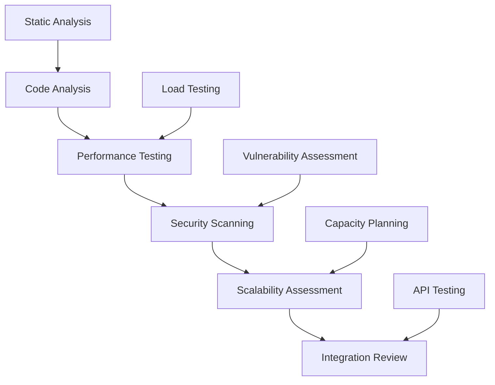

# Architecture Audit

## Overview

```yaml
service: Architecture Audit & Review
type: Technical Assessment & Strategy
duration: 4-8 weeks
focus_areas:
  - scalability_assessment
  - security_evaluation  
  - performance_optimization
  - maintainability_review
```

## Audit Scope

### Technical Architecture Review

```python
def architecture_audit():
    assessment_areas = {
        'scalability': analyze_scaling_patterns(),
        'performance': evaluate_performance_characteristics(),
        'security': assess_security_posture(),
        'maintainability': review_code_organization(),
        'reliability': examine_fault_tolerance()
    }
    
    return comprehensive_analysis(assessment_areas)
```

### Infrastructure & Operations

```bash
# Infrastructure assessment
$ audit_cloud_architecture --scalability --cost_optimization
$ evaluate_deployment_processes --automation --reliability
$ assess_monitoring_observability --coverage --effectiveness
$ review_security_practices --compliance --best_practices
```

## Audit Process

### Phase 1: Architecture Documentation & Analysis

```yaml
documentation_review:
  current_state:
    - system_architecture_diagrams
    - data_flow_documentation
    - integration_specifications
    - deployment_procedures
    
  gap_analysis:
    - missing_documentation
    - outdated_specifications
    - unclear_dependencies
    - undocumented_decisions
```

### Phase 2: Technical Deep Dive



### Phase 3: Risk Assessment & Recommendations

```python
def risk_assessment():
    risks = {
        'critical': identify_critical_vulnerabilities(),
        'high': find_scalability_bottlenecks(),
        'medium': detect_maintenance_issues(),
        'low': note_optimization_opportunities()
    }
    
    return prioritized_recommendation_matrix(risks)
```

## Assessment Dimensions

### Scalability Analysis

| Component | Assessment Criteria | Typical Issues |
|-----------|-------------------|----------------|
| **Database** | Query performance, indexing, sharding | N+1 queries, missing indexes, poor schema design |
| **API Layer** | Rate limiting, caching, load distribution | No rate limiting, inefficient endpoints |
| **Services** | Horizontal scaling, statelessness | Tight coupling, shared state, monolithic design |
| **Infrastructure** | Auto-scaling, resource utilization | Manual scaling, resource waste |

### Security Evaluation

```yaml
security_checklist:
  authentication:
    - multi_factor_authentication
    - session_management
    - password_policies
    - oauth_implementation
    
  authorization:
    - role_based_access_control
    - api_security
    - principle_of_least_privilege
    - resource_protection
    
  data_protection:
    - encryption_at_rest
    - encryption_in_transit
    - pii_handling
    - backup_security
    
  infrastructure:
    - network_security
    - container_security
    - cloud_security_configuration
    - vulnerability_management
```

### Performance Assessment

```python
def performance_audit():
    metrics = {
        'response_times': measure_api_latency(),
        'throughput': calculate_request_capacity(),
        'resource_usage': analyze_cpu_memory_patterns(),
        'database_performance': evaluate_query_efficiency(),
        'caching_effectiveness': assess_cache_hit_rates()
    }
    
    benchmarks = establish_performance_baselines(metrics)
    recommendations = identify_optimization_opportunities(benchmarks)
    
    return performance_improvement_roadmap(recommendations)
```

## Audit Deliverables

### Executive Summary Report

```yaml
executive_summary:
  current_state_overview:
    - architecture_maturity_assessment
    - technical_debt_quantification
    - risk_level_classification
    - business_impact_analysis
    
  strategic_recommendations:
    - immediate_action_items
    - medium_term_improvements
    - long_term_architectural_evolution
    - investment_prioritization
```

### Technical Deep Dive

```markdown
## Technical Report Structure

### 1. Architecture Analysis
- Current architecture documentation
- Component interaction mapping
- Data flow analysis
- Integration assessment

### 2. Performance Evaluation  
- Load testing results
- Performance bottleneck identification
- Optimization recommendations
- Capacity planning guidance

### 3. Security Assessment
- Vulnerability analysis
- Compliance gap assessment
- Security improvement roadmap
- Risk mitigation strategies

### 4. Maintainability Review
- Code quality metrics
- Documentation assessment
- Development process evaluation
- Technical debt analysis
```

### Implementation Roadmap

```python
def create_implementation_roadmap():
    phases = {
        'immediate': {
            'timeframe': '0-3 months',
            'focus': 'Critical fixes and quick wins',
            'examples': ['security_patches', 'performance_hotfixes']
        },
        'short_term': {
            'timeframe': '3-9 months', 
            'focus': 'Foundational improvements',
            'examples': ['monitoring_implementation', 'ci_cd_optimization']
        },
        'long_term': {
            'timeframe': '9-24 months',
            'focus': 'Strategic architectural changes',
            'examples': ['microservices_migration', 'cloud_optimization']
        }
    }
    return phases
```

## Audit Outcomes & Success Stories

### SaaS Platform Scaling Preparation

```yaml
client: "B2B SaaS preparing for 10x user growth"
challenge: "Architecture readiness for rapid scaling"
audit_focus:
  - database_scalability_limits
  - api_performance_bottlenecks
  - infrastructure_auto_scaling
  - monitoring_observability_gaps

findings:
  critical_issues: 5
  major_improvements: 12
  optimization_opportunities: 20

implementation_results:
  scaling_capacity: "+1500% without architecture changes"
  performance_improvement: "+70% response time optimization"
  infrastructure_costs: "-40% through optimization"
  deployment_reliability: "99.9% uptime achievement"
```

### Financial Services Security Audit

```yaml
client: "Fintech startup preparing for SOC2 compliance"
challenge: "Security architecture review and compliance preparation"
audit_scope:
  - authentication_authorization_review
  - data_encryption_assessment
  - api_security_evaluation
  - infrastructure_hardening_review

compliance_gaps_identified: 18
security_vulnerabilities_found: 12
remediation_roadmap_created: "6-month implementation plan"

certification_outcome:
  soc2_compliance: "Achieved on first audit attempt"
  security_posture: "Industry-leading security practices"
  customer_trust: "Enterprise customer acquisition enabled"
  regulatory_confidence: "Full regulatory compliance"
```

### E-commerce Platform Optimization

```yaml
client: "High-traffic e-commerce platform"
challenge: "Performance issues during peak traffic periods"
audit_methodology:
  - load_testing_simulation
  - database_query_optimization
  - caching_strategy_review
  - cdn_configuration_assessment

performance_improvements:
  page_load_times: "+60% improvement"
  database_query_efficiency: "+40% faster queries"
  infrastructure_costs: "-25% cost reduction"
  user_experience: "+30% conversion rate improvement"

business_impact:
  revenue_protection: "$2M+ in prevented lost sales"
  customer_satisfaction: "+25% improvement in NPS"
  operational_efficiency: "-50% support ticket reduction"
```

## Audit Investment & ROI

### Engagement Scope & Pricing

```yaml
audit_packages:
  focused_audit:
    duration: "3-4 weeks"
    scope: "Specific domain (security, performance, etc.)"
    investment: "$25k-45k"
    deliverables: ["targeted_assessment", "improvement_roadmap"]
    
  comprehensive_audit:
    duration: "5-8 weeks" 
    scope: "Complete architecture review"
    investment: "$45k-85k"
    deliverables: ["full_technical_report", "strategic_roadmap"]
    
  ongoing_reviews:
    frequency: "Quarterly"
    scope: "Continuous architecture health monitoring"
    investment: "$10k-20k per review"
    deliverables: ["progress_assessment", "updated_recommendations"]
```

### Return on Investment

| Improvement Area | Typical Results | Business Value |
|------------------|----------------|----------------|
| **Performance** | 40-80% response time improvement | Better user experience, higher conversion |
| **Scalability** | 5-20x capacity increase | Support growth without major rewrites |
| **Security** | 90%+ vulnerability reduction | Risk mitigation, compliance achievement |
| **Reliability** | 50-90% incident reduction | Reduced downtime costs, better SLAs |
| **Efficiency** | 30-60% cost optimization | Lower infrastructure and operational costs |

## Getting Started

### Pre-Audit Preparation

```bash
# Audit preparation checklist
$ gather_architecture_documentation --current --historical
$ prepare_system_access --development --staging --production
$ schedule_stakeholder_interviews --technical --business
$ define_audit_scope --priorities --constraints --timeline
```

### Audit Initiation Process

1. **Scope Definition** - Determine audit boundaries and priorities
2. **Access Setup** - Establish secure access to systems and documentation
3. **Stakeholder Interviews** - Understand context and constraints
4. **Technical Discovery** - Begin systematic architecture analysis
5. **Progress Reviews** - Regular updates and preliminary findings
6. **Final Presentation** - Comprehensive results and recommendations

## Next Steps

Ready to ensure your architecture can support your growth ambitions and business requirements?

```bash
# Schedule architecture audit consultation
curl -X POST https://mikeshogin.com/contact \
  -H "Content-Type: application/json" \
  -d '{
    "service": "Architecture Audit",
    "focus_areas": ["scalability", "security", "performance"],
    "timeline": "planning_phase",
    "message": "Interested in comprehensive architecture review"
  }'
```

**[Schedule Audit Consultation →](mailto:contact@mikeshogin.com?subject=Architecture%20Audit%20Consultation)**

---

> *"The architecture audit revealed critical scalability issues we hadn't considered. Mike's roadmap helped us address them systematically, and we successfully handled 5x traffic growth during our product launch."*  
> **— Lisa Wang, CTO at InnovateTech** 