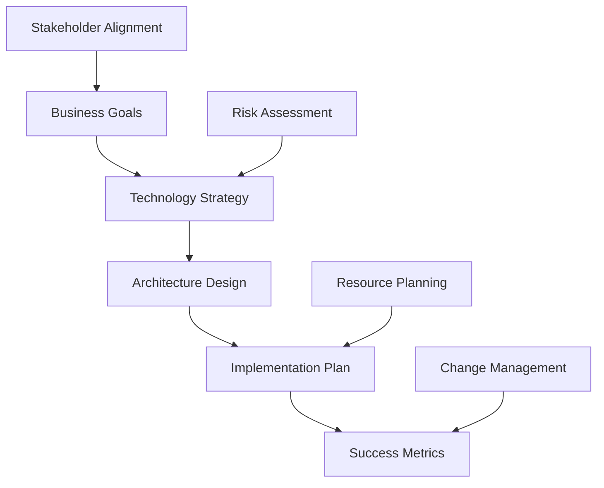

# IT Consulting

## Overview

```yaml
service: Strategic IT Consulting
type: Technology Strategy & Implementation
engagement_types:
  - strategic_consulting
  - implementation_guidance  
  - fractional_cto
  - advisory_retainer
```

## Service Areas

### Technology Strategy & Roadmap

```python
def technology_strategy():
    return {
        'business_alignment': assess_technology_business_fit(),
        'competitive_analysis': evaluate_market_positioning(),
        'roadmap_development': create_strategic_roadmap(),
        'risk_mitigation': identify_technology_risks(),
        'investment_planning': optimize_technology_spending()
    }
```

### Architecture & Scalability

```yaml
architecture_consulting:
  assessment:
    - current_architecture_review
    - scalability_bottleneck_identification  
    - performance_optimization_opportunities
    - security_vulnerability_assessment
    
  design:
    - target_architecture_definition
    - migration_strategy_development
    - implementation_roadmap_creation
    - success_metrics_establishment
```

### Team & Process Optimization

```bash
# Development process optimization
$ analyze_development_workflow --bottlenecks --inefficiencies
$ optimize_ci_cd_pipeline --automation --quality_gates  
$ implement_best_practices --code_review --testing
$ establish_metrics --velocity --quality --satisfaction
```

## Consulting Engagements

### Strategic Consulting (1-3 months)

```yaml
strategic_engagement:
  focus: "High-level technology strategy and planning"
  deliverables:
    - technology_strategy_document
    - architecture_recommendations
    - implementation_roadmap
    - risk_assessment_matrix
    - investment_priorities
    
  typical_outcomes:
    - clear_technology_direction
    - aligned_business_technology_goals
    - prioritized_improvement_initiatives
    - reduced_technology_risks
```

### Fractional CTO (6-18 months)

```python
class FractionalCTO:
    def __init__(self, company):
        self.company = company
        self.responsibilities = [
            'technology_strategy_leadership',
            'engineering_team_development', 
            'architecture_decision_oversight',
            'stakeholder_communication',
            'technology_risk_management'
        ]
    
    def monthly_activities(self):
        return {
            'strategic_planning': 'Technology roadmap and priorities',
            'team_development': 'Engineering leadership and mentoring',
            'architecture_review': 'System design and technical decisions',
            'stakeholder_updates': 'Board and investor communication'
        }
```

## Success Stories

### SaaS Startup Technical Foundation

```yaml
client: "Series A SaaS startup"
challenge: "Rapid growth needed scalable technical foundation"
approach: "6-month strategic consulting + implementation guidance"

initiatives:
  architecture:
    - microservices_migration_strategy
    - cloud_infrastructure_optimization
    - monitoring_observability_implementation
    
  team:
    - engineering_process_establishment
    - hiring_technical_interview_process
    - onboarding_documentation_creation
    
  culture:
    - code_review_standards
    - technical_decision_documentation
    - knowledge_sharing_practices

results:
  development_velocity: "+200% feature delivery speed"
  system_reliability: "99.9% uptime achievement"
  team_satisfaction: "90% engineer satisfaction scores"
  business_impact: "Zero technical blockers for product roadmap"
```

### Enterprise Digital Transformation

```yaml
client: "Fortune 500 manufacturing company"
challenge: "Legacy system modernization and digital transformation"
approach: "12-month fractional CTO engagement"

transformation_areas:
  infrastructure:
    - cloud_migration_strategy
    - microservices_architecture_adoption
    - api_first_development_approach
    
  processes:
    - agile_methodology_implementation
    - devops_culture_development
    - continuous_integration_deployment
    
  team:
    - technical_skills_development
    - modern_development_practices
    - cross_functional_collaboration

outcomes:
  time_to_market: "-50% feature delivery time"
  operational_costs: "-40% infrastructure costs"
  innovation_capacity: "+300% new feature development"
  competitive_advantage: "Market leadership in digital capabilities"
```

## Consulting Methodology

### Discovery & Assessment Phase

```bash
# Comprehensive assessment process
$ analyze_current_state --technology --team --processes
$ identify_pain_points --technical --organizational --business
$ evaluate_competitive_position --market --technology --capabilities
$ assess_growth_readiness --scalability --team --infrastructure
```

### Strategy Development



### Implementation Guidance

```python
def implementation_support():
    phases = {
        'foundation': {
            'duration': '1-2 months',
            'focus': 'Infrastructure and team setup',
            'deliverables': ['architecture_baseline', 'team_processes']
        },
        'optimization': {
            'duration': '2-4 months', 
            'focus': 'Performance and efficiency improvements',
            'deliverables': ['optimized_systems', 'improved_processes']
        },
        'scaling': {
            'duration': '3-6 months',
            'focus': 'Growth enablement and team scaling',
            'deliverables': ['scalable_architecture', 'expanded_team']
        }
    }
    return phases
```

## Investment & ROI

### Engagement Models

| Engagement Type | Duration | Investment Range | Best For |
|----------------|----------|------------------|----------|
| **Strategic Consulting** | 1-3 months | $25k-75k | Specific challenges, roadmap development |
| **Implementation Guidance** | 3-6 months | $50k-150k | Active project support and execution |
| **Fractional CTO** | 6-18 months | $15k-30k/month | Ongoing leadership and strategy |
| **Advisory Retainer** | Ongoing | $5k-15k/month | Periodic guidance and support |

### Expected Returns

```yaml
roi_indicators:
  development_efficiency:
    metric: "Development velocity increase"
    typical_improvement: "30-60%"
    business_impact: "Faster time-to-market"
    
  system_reliability:
    metric: "Production incident reduction" 
    typical_improvement: "40-70%"
    business_impact: "Better user experience, reduced costs"
    
  team_productivity:
    metric: "Engineer satisfaction and retention"
    typical_improvement: "25-50%"
    business_impact: "Reduced hiring costs, knowledge retention"
    
  business_agility:
    metric: "Feature delivery speed"
    typical_improvement: "40-80%"
    business_impact: "Competitive advantage, revenue growth"
```

## Technology Expertise

### Cloud & Infrastructure

```yaml
cloud_platforms:
  aws: ["EC2", "Lambda", "RDS", "S3", "CloudFormation"]
  azure: ["App Services", "Functions", "SQL Database", "Storage"]
  gcp: ["Compute Engine", "Cloud Functions", "Cloud SQL", "Storage"]
  
containerization:
  - docker
  - kubernetes
  - docker_compose
  - helm_charts
  
infrastructure_as_code:
  - terraform
  - cloudformation
  - ansible
  - pulumi
```

### Development & Architecture

```python
expertise = {
    'languages': ['Python', 'TypeScript', 'Go', 'Java'],
    'frameworks': ['React', 'Node.js', 'Django', 'Spring Boot'],
    'databases': ['PostgreSQL', 'MongoDB', 'Redis', 'Elasticsearch'],
    'architecture_patterns': [
        'microservices',
        'event_driven',
        'domain_driven_design',
        'clean_architecture'
    ],
    'monitoring': ['Prometheus', 'Grafana', 'ELK Stack', 'DataDog']
}
```

## Getting Started

### Initial Consultation

```bash
# Consultation preparation
$ prepare_business_context --goals --challenges --constraints
$ gather_technical_information --architecture --team --processes  
$ define_success_criteria --business --technical --timeline
$ establish_engagement_scope --duration --deliverables --budget
```

### Engagement Process

1. **Discovery Call** - Understand challenges and goals
2. **Assessment Proposal** - Define scope and approach  
3. **Stakeholder Alignment** - Confirm objectives and success criteria
4. **Engagement Kickoff** - Begin strategic consultation
5. **Regular Reviews** - Progress tracking and course correction
6. **Knowledge Transfer** - Ensure sustainable implementation

## Next Steps

Ready to develop your technology strategy and accelerate your digital transformation?

```bash
# Schedule strategic consultation
curl -X POST https://mikeshogin.com/contact \
  -H "Content-Type: application/json" \
  -d '{
    "service": "IT Consulting",
    "engagement_type": "strategic_consultation", 
    "company_stage": "growth",
    "message": "Interested in technology strategy discussion"
  }'
```

**[Schedule Consultation →](mailto:contact@mikeshogin.com?subject=IT%20Consulting%20Inquiry)**

---

> *"Mike's strategic guidance helped us avoid costly technical decisions and establish processes that scaled with our rapid growth. His business-focused approach made the difference."*  
> **— David Park, CEO at GrowthCorp** 