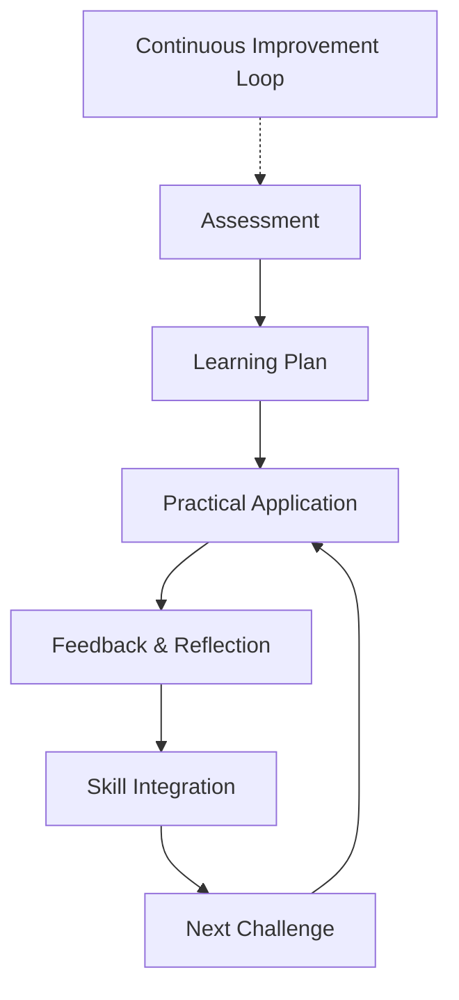

# Mentorship & Coaching

## Overview

```yaml
service: Technical Mentorship & Career Coaching
type: Professional Development
duration: 3-12 months
focus_areas:
  - technical_leadership
  - career_advancement
  - engineering_management
  - architectural_thinking
```

## Program Structure

### Technical Leadership Development
**Target**: Senior Engineers → Staff+ Roles

```python
def technical_leadership_program():
    curriculum = {
        'system_design': [
            'architectural_patterns',
            'scalability_planning',
            'technology_evaluation',
            'technical_decision_making'
        ],
        'influence': [
            'cross_team_collaboration',
            'technical_communication',
            'consensus_building',
            'change_management'
        ],
        'delivery': [
            'project_planning',
            'risk_management',
            'quality_assurance',
            'performance_optimization'
        ]
    }
    
    return structured_learning_path(curriculum)
```

### Engineering Management Transition
**Target**: Individual Contributors → Engineering Managers

```yaml
management_transition:
  phase_1_foundation:
    duration: "months 1-3"
    focus:
      - management_fundamentals
      - team_dynamics
      - one_on_one_skills
      - performance_feedback
      
  phase_2_leadership:
    duration: "months 4-6"
    focus:
      - strategic_thinking
      - roadmap_planning
      - stakeholder_management
      - conflict_resolution
      
  phase_3_scaling:
    duration: "months 7-9"
    focus:
      - team_scaling
      - process_optimization
      - culture_development
      - organizational_impact
```

## Mentorship Methodology

### Assessment & Goal Setting

```bash
# Initial assessment
$ assess_current_state --technical --leadership --goals
$ identify_skill_gaps --architecture --communication --influence
$ define_success_metrics --promotion --impact --satisfaction
$ create_development_plan --timeline --milestones --resources
```

### Learning Framework



### Mentorship Sessions

| Session Type | Frequency | Duration | Focus |
|-------------|-----------|----------|-------|
| **1:1 Coaching** | Weekly | 60 min | Skill development, problem-solving |
| **Technical Reviews** | Bi-weekly | 90 min | Architecture, code reviews, design |
| **Career Planning** | Monthly | 60 min | Goal setting, progress tracking |
| **Practice Interviews** | As needed | 60 min | Technical/behavioral interview prep |

## Success Stories

### From Senior to Staff Engineer

```yaml
participant: "Alex - Senior Frontend Developer"
challenge: "Struggling to increase impact beyond immediate team"
program: "6-month Technical Leadership Development"

journey:
  month_1_2:
    focus: "System design fundamentals"
    activities:
      - architecture_review_sessions
      - design_pattern_workshops
      - scalability_case_studies
      
  month_3_4:
    focus: "Cross-team collaboration"
    activities:
      - technical_proposal_writing
      - stakeholder_presentation_practice
      - consensus_building_exercises
      
  month_5_6:
    focus: "Technical influence"
    activities:
      - architecture_decision_leadership
      - mentoring_junior_developers
      - technical_standards_definition

outcome:
  promotion: "Staff Engineer"
  impact: "Leading architecture decisions across 3 teams"
  satisfaction: "95% increase in job satisfaction"
  timeline: "5 months (1 month ahead of schedule)"
```

### Management Transition Success

```yaml
participant: "Maria - Senior Backend Developer"
challenge: "Promoted to manager without management training"
program: "9-month Management Transition Coaching"

development_areas:
  technical_to_people:
    - team_building
    - performance_management
    - difficult_conversations
    - delegation_skills
    
  strategic_thinking:
    - roadmap_planning
    - resource_allocation
    - stakeholder_communication
    - business_alignment

results:
  team_productivity: "+35% increase"
  employee_satisfaction: "Top quartile scores"
  retention_rate: "100% team retention"
  personal_growth: "Confident, effective manager"
```

## Coaching Specializations

### System Design Mastery

```python
class SystemDesignCoaching:
    def __init__(self):
        self.fundamentals = [
            'scalability_patterns',
            'reliability_engineering',
            'performance_optimization',
            'data_architecture'
        ]
        
    def practice_sessions(self):
        return [
            'whiteboard_design_exercises',
            'real_world_case_studies',
            'architecture_review_simulations',
            'scalability_challenge_scenarios'
        ]
        
    def skill_progression(self):
        return {
            'beginner': 'Component design, basic patterns',
            'intermediate': 'System integration, trade-offs',
            'advanced': 'Large-scale systems, innovation',
            'expert': 'Industry leadership, complex domains'
        }
```

### Technical Communication

```yaml
communication_development:
  written_skills:
    - technical_documentation
    - architecture_decision_records
    - proposal_writing
    - code_review_feedback
    
  verbal_skills:
    - technical_presentations
    - stakeholder_meetings
    - team_discussions
    - conference_speaking
    
  visual_skills:
    - system_diagrams
    - architecture_visualization
    - data_flow_mapping
    - process_documentation
```

### Career Strategy

```bash
# Career advancement framework
$ define_career_goals --level --timeline --impact
$ identify_skill_requirements --technical --leadership
$ create_visibility_strategy --internal --external
$ build_professional_network --mentors --peers --industry
$ track_progress_metrics --promotions --impact --recognition
```

## Mentorship Programs

### Individual Mentorship

```yaml
individual_program:
  duration: "3-6 months"
  format: "1:1 sessions + practical exercises"
  investment: "$2,500-5,000/month"
  includes:
    - weekly_coaching_sessions
    - personalized_learning_plan
    - real_project_guidance
    - interview_preparation
    - career_strategy_development
```

### Group Mentorship

```yaml
group_program:
  duration: "6 months"
  format: "Group sessions + peer learning"
  investment: "$1,500-2,500/month per person"
  group_size: "4-6 participants"
  includes:
    - bi_weekly_group_sessions
    - peer_learning_exercises
    - group_project_collaboration
    - shared_learning_resources
    - networking_opportunities
```

### Corporate Programs

```yaml
corporate_mentorship:
  program_types:
    - leadership_development
    - technical_skills_acceleration
    - management_transition_support
    - high_potential_employee_programs
    
  delivery_options:
    - on_site_workshops
    - virtual_mentorship_sessions
    - hybrid_learning_programs
    - train_the_trainer_initiatives
```

## ROI & Outcomes

### Typical Results

| Metric | Individual | Team | Organization |
|--------|------------|------|--------------|
| **Promotion Rate** | 80% within 12 months | +25% team advancement | Higher internal mobility |
| **Performance** | +40% skill improvement | +30% team productivity | Better project outcomes |
| **Retention** | 95% retention rate | +50% team satisfaction | Reduced turnover costs |
| **Leadership** | Increased influence | More technical leaders | Stronger engineering culture |

### Success Indicators

```python
def measure_success():
    quantitative_metrics = {
        'skill_assessment_scores': 'baseline vs current',
        'promotion_timeline': 'actual vs target',
        'project_impact': 'before vs after mentorship',
        'team_feedback': '360 degree reviews'
    }
    
    qualitative_indicators = {
        'confidence_level': 'self-reported improvements',
        'job_satisfaction': 'engagement surveys',
        'career_clarity': 'goal achievement',
        'professional_growth': 'competency development'
    }
    
    return {**quantitative_metrics, **qualitative_indicators}
```

## Getting Started

### Initial Consultation

```yaml
consultation_process:
  assessment:
    - current_role_and_responsibilities
    - career_goals_and_timeline
    - skill_gaps_identification
    - learning_style_preferences
    
  program_design:
    - customized_learning_path
    - session_frequency_planning
    - success_metrics_definition
    - timeline_and_milestones
```

### Prerequisites

```bash
# Prepare for mentorship
$ define_career_objectives --specific --measurable
$ assess_current_skills --technical --leadership
$ commit_time_investment --weekly_sessions --practice
$ establish_learning_mindset --growth --feedback
```

## Next Steps

Ready to accelerate your career growth and technical leadership development?

```bash
# Book initial consultation
curl -X POST https://mikeshogin.com/contact \
  -H "Content-Type: application/json" \
  -d '{
    "service": "Mentorship Consultation",
    "career_level": "senior_developer",
    "goals": "technical_leadership",
    "message": "Interested in mentorship program"
  }'
```

**[Schedule Consultation →](mailto:contact@mikeshogin.com?subject=Mentorship%20Consultation)**

---

> *"Mike's mentorship transformed not just my technical skills, but my entire approach to leadership. The structured program gave me the confidence and tools I needed to succeed as a new engineering manager."*  
> **— Alex Rodriguez, Engineering Manager at FastGrow** 