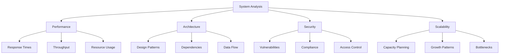

# System Analysis

## Overview

```yaml
service: System Analysis
type: Technical Assessment
duration: 4-6 weeks
deliverables:
  - comprehensive_report
  - implementation_roadmap
  - risk_assessment
  - architectural_recommendations
```

## What is System Analysis?

System analysis is a methodical examination of your technical infrastructure, architecture, and processes to identify inefficiencies, bottlenecks, and opportunities for strategic improvement.

### Key Focus Areas



## Target Audience

### Development Teams
- Teams struggling with slow deployment cycles
- Organizations with high bug rates or production issues
- Groups facing scalability challenges as they grow

### Technical Leadership
- CTOs and engineering managers planning technical roadmaps
- Teams preparing for significant growth or scaling events
- Organizations considering technology stack changes

### Product Teams
- Companies where technical limitations block product development
- Teams with frequent feature development delays
- Organizations struggling to meet performance requirements

## Analysis Process

### Phase 1: Discovery & Context (Week 1)

```bash
# Information gathering
$ collect_requirements --stakeholders=all
$ analyze_business_context --goals --constraints
$ review_documentation --architecture --processes
$ interview_team_members --pain-points --challenges
```

**Deliverables:**
- Stakeholder interview summary
- Business context documentation
- Current pain points analysis
- Team structure assessment

### Phase 2: Technical Assessment (Weeks 2-4)

```python
def technical_assessment():
    architecture = analyze_system_architecture()
    performance = evaluate_performance_metrics()
    security = assess_security_posture()
    code_quality = review_codebase_quality()
    infrastructure = analyze_infrastructure()
    
    return consolidate_findings(
        architecture, performance, security, 
        code_quality, infrastructure
    )
```

**Focus Areas:**
- Architecture patterns and design decisions
- Performance bottlenecks and optimization opportunities
- Security vulnerabilities and compliance gaps
- Code quality and maintainability metrics
- Infrastructure efficiency and cost optimization

### Phase 3: Analysis & Recommendations (Week 5)

```yaml
analysis_output:
  findings:
    - performance_bottlenecks
    - security_vulnerabilities
    - architectural_debt
    - scalability_limitations
    - process_inefficiencies
    
  recommendations:
    - immediate_actions
    - medium_term_improvements
    - long_term_strategic_changes
    
  implementation:
    - prioritized_roadmap
    - resource_requirements
    - timeline_estimates
    - success_metrics
```

### Phase 4: Presentation & Handoff (Week 6)

```markdown
## Deliverables
- Executive summary presentation
- Detailed technical report
- Implementation roadmap
- Risk assessment matrix
- Cost-benefit analysis
```

## Example Outcomes

### E-commerce Platform Optimization

```yaml
challenge: "Slow page loads and checkout failures during peak traffic"
analysis_focus:
  - database_query_optimization
  - caching_strategies
  - cdn_implementation
  - infrastructure_scaling

results:
  page_load_improvement: "+40%"
  cart_abandonment_reduction: "-25%"
  infrastructure_cost_savings: "-20%"
  deployment_time_improvement: "+60%"
```

### Microservices Architecture Review

```yaml
challenge: "Complex microservices architecture difficult to maintain"
analysis_focus:
  - service_boundaries
  - communication_patterns
  - data_consistency
  - deployment_complexity

results:
  service_count_reduction: "-30%"
  deployment_reliability: "+50%"
  development_velocity: "+40%"
  operational_overhead: "-35%"
```

### Legacy System Modernization

```yaml
challenge: "10-year-old monolithic application needs modernization"
analysis_focus:
  - migration_strategies
  - risk_assessment
  - phased_approach
  - business_continuity

results:
  modernization_roadmap: "18 months"
  business_disruption: "minimal"
  maintenance_cost_reduction: "-40%"
  feature_velocity_increase: "+70%"
```

## Assessment Dimensions

### Performance Analysis

| Metric | Assessment | Typical Issues |
|--------|------------|----------------|
| **Response Time** | API endpoints, page loads | Slow database queries, inefficient algorithms |
| **Throughput** | Requests per second | Bottlenecks, resource constraints |
| **Resource Usage** | CPU, Memory, Storage | Memory leaks, inefficient resource allocation |
| **Scalability** | Load handling capacity | Single points of failure, architectural limits |

### Security Assessment

```yaml
security_checklist:
  authentication:
    - multi_factor_authentication
    - session_management
    - password_policies
    
  authorization:
    - role_based_access_control
    - principle_of_least_privilege
    - api_security
    
  data_protection:
    - encryption_at_rest
    - encryption_in_transit
    - data_backup_strategy
    
  compliance:
    - gdpr_compliance
    - security_standards
    - audit_logging
```

### Architecture Review

```python
def architecture_assessment():
    patterns = evaluate_design_patterns()
    coupling = analyze_component_coupling()
    cohesion = measure_module_cohesion()
    dependencies = map_dependency_graph()
    
    return {
        'maintainability': calculate_maintainability_index(),
        'testability': assess_test_coverage(),
        'scalability': evaluate_scaling_patterns(),
        'reliability': measure_fault_tolerance()
    }
```

## Investment & ROI

### Typical Investment

```yaml
analysis_scope:
  small_system: "2-3 weeks, $15-25k"
  medium_system: "4-5 weeks, $25-40k"
  large_system: "6-8 weeks, $40-60k"
  enterprise_system: "8-12 weeks, $60-100k"
```

### Expected ROI

| Area | Typical Improvement | Business Impact |
|------|-------------------|----------------|
| **Performance** | 30-70% faster response times | Better user experience, higher conversion |
| **Scalability** | 5-10x capacity increase | Support growth without infrastructure overhaul |
| **Security** | 80-95% vulnerability reduction | Risk mitigation, compliance achievement |
| **Development** | 40-60% velocity increase | Faster time-to-market, reduced costs |

## Getting Started

### Prerequisites

```bash
# Prepare for analysis
$ gather_system_documentation
$ prepare_access_credentials  
$ schedule_stakeholder_interviews
$ define_success_criteria
```

### Initial Consultation

```yaml
consultation_agenda:
  - current_challenges_assessment
  - business_goals_alignment
  - technical_scope_definition
  - timeline_and_budget_planning
  - team_availability_coordination
```

## Next Steps

Ready to gain clarity on your system's current state and optimization opportunities?

```bash
# Schedule discovery call
curl -X POST https://mikeshogin.com/contact \
  -H "Content-Type: application/json" \
  -d '{
    "service": "System Analysis",
    "urgency": "strategic_planning",
    "message": "Let'\''s discuss system optimization opportunities"
  }'
```

**[Schedule Consultation →](mailto:contact@mikeshogin.com?subject=System%20Analysis%20Consultation)**

---

> *"The analysis Mike provided gave us the roadmap we needed to confidently move forward with our technical modernization. His recommendations were practical, well-prioritized, and directly tied to our business goals."*  
> **— Sarah Chen, CTO at TechStartup** 