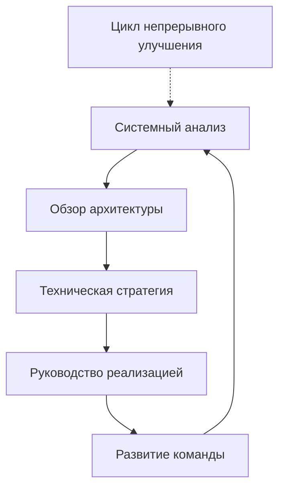

# Обо мне - Майк Шогин

## WhoAmI

```bash
$ whoami
mike.shogin
$ cat /etc/profile
# Системный аналитик и IT-архитектор
# Локация: Удаленно / Глобально
# Фокус: Системный анализ, архитектура, техническое лидерство
# Опыт: 10+ лет в разработке ПО
```

## Профессиональная идентичность

Я **системный аналитик и IT-архитектор**, который помогает инженерным командам и организациям создавать лучшие системы через стратегический анализ, архитектурное руководство и техническое лидерство. Мой подход сочетает глубокие технические знания с пониманием бизнеса для создания практических, устойчивых решений.

### Основные компетенции

```yaml
технические_навыки:
  - системный_анализ
  - проектирование_архитектуры
  - оптимизация_производительности
  - оценка_технического_долга
  - аудит_безопасности

навыки_лидерства:
  - техническое_наставничество
  - масштабирование_команд
  - оптимизация_процессов
  - стратегическое_планирование
  - коммуникация_с_заинтересованными_сторонами

домены:
  - веб_приложения
  - микросервисы
  - распределенные_системы
  - облачная_инфраструктура
  - архитектура_данных
```

## Техническая философия

### Принципы

> **Ясность важнее сложности**  
> Простые решения, которые работают, лучше сложных, которые не работают.

> **Устойчивый рост**  
> Построение систем и команд, которые могут развиваться вместе с потребностями бизнеса.

> **Решения на основе фактов**  
> Использование данных и анализа для руководства техническими решениями.

> **Передача знаний**  
> Обучение команд самостоятельному поддержанию и улучшению систем.

## Обзор опыта

### Системный анализ и архитектура
- **10+ лет** проектирования и анализа архитектур систем
- **50+ проектов** от стартапов до корпоративной среды
- **Множество доменов**: Электронная коммерция, FinTech, SaaS, корпоративное ПО

### Техническое лидерство
- Руководил архитектурными решениями для систем, обслуживающих **10M+ пользователей**
- Управлял проектами по сокращению технического долга, экономящими **$2M+ ежегодно**
- Спроектировал миграции в облако, снижающие затраты на инфраструктуру на **40%**

### Развитие команд
- Менторство **100+ разработчиков** от джуниор до staff engineer уровня
- Помощь **20+ инженерным менеджерам** в переходе с технических ролей
- Разработка программ адаптации, сокращающих время до продуктивности на **60%**

## Текущий фокус



### Области специализации

| Домен | Фокусные области | Типичные результаты |
|-------|------------------|---------------------|
| **Производительность** | Анализ узких мест, стратегии оптимизации | 40-70% улучшение времени отклика |
| **Масштабируемость** | Проектирование архитектуры, планирование мощности | Поддержка роста в 10x+ без переписывания |
| **Безопасность** | Оценка уязвимостей, соответствие требованиям | Ноль критических инцидентов безопасности |
| **Эффективность команды** | Оптимизация процессов, инструменты | 30-60% увеличение скорости разработки |

## Технологический стек

### Текущие предпочтения

**Языки**: TypeScript, Python, Go, Java  
**Фреймворки**: React, Node.js, Django, Spring Boot  
**Базы данных**: PostgreSQL, Redis, MongoDB  
**Инфраструктура**: AWS, Docker, Kubernetes, Terraform  
**Мониторинг**: Prometheus, Grafana, ELK Stack  

### Архитектурные паттерны

- **Микросервисы** с событийно-ориентированной архитектурой
- **CQRS/Event Sourcing** для сложных доменов
- **Гексагональная архитектура** для поддерживаемого кода
- **Domain-Driven Design** для крупных систем

## Методология

### Фреймворк анализа

1. **Исследование контекста** - Понимание бизнес-целей и ограничений
2. **Оценка текущего состояния** - Техническая и процессная оценка
3. **Анализ пробелов** - Выявление возможностей для улучшения
4. **Проектирование решения** - Планирование архитектуры и реализации
5. **Создание дорожной карты** - Поэтапный подход с четкими этапами
6. **Передача знаний** - Обеспечение независимости команды

### Консультационный подход

```python
def analyze_system(context):
    """
    Систематический подход к анализу систем
    """
    discovery = gather_requirements(context)
    assessment = evaluate_current_state(discovery)
    gaps = identify_opportunities(assessment)
    solutions = design_improvements(gaps)
    roadmap = create_implementation_plan(solutions)
    
    return deliver_with_knowledge_transfer(roadmap)
```

## Контакты и сотрудничество

### Предпочтительные способы коммуникации

- **Технические обсуждения**: Глубокие обзоры архитектуры
- **Стратегическое планирование**: Разработка технологических дорожных карт
- **Решение проблем**: Сложные системные вызовы
- **Наставничество**: Развитие карьеры и технический рост

### Доступность

- **Консалтинг**: Стратегические проекты (1-6 месяцев)
- **Наставничество**: Индивидуальные и командные программы
- **Консультирование**: Постоянное техническое руководство
- **Выступления**: Технические конференции и воркшопы

---

## Давайте свяжемся

```bash
# Свяжитесь для технических обсуждений
curl -X POST https://mikeshogin.com/contact \
  -H "Content-Type: application/json" \
  -d '{
    "subject": "Техническая консультация",
    "message": "Давайте обсудим ваши архитектурные вызовы"
  }'
```

**Email**: [contact@mikeshogin.com](mailto:contact@mikeshogin.com)  
**LinkedIn**: [linkedin.com/in/mikeshogin](https://linkedin.com/in/mikeshogin)  
**GitHub**: [github.com/mikeshogin](https://github.com/mikeshogin)

*Готовы оптимизировать ваши системы и масштабировать команду? Давайте изучим, как стратегический анализ и техническая экспертиза могут ускорить ваш рост.* 
