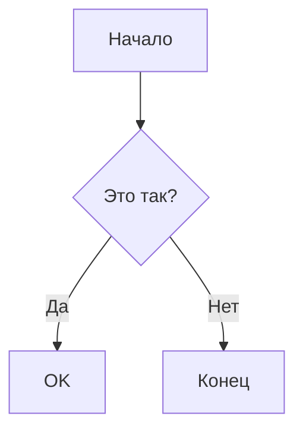
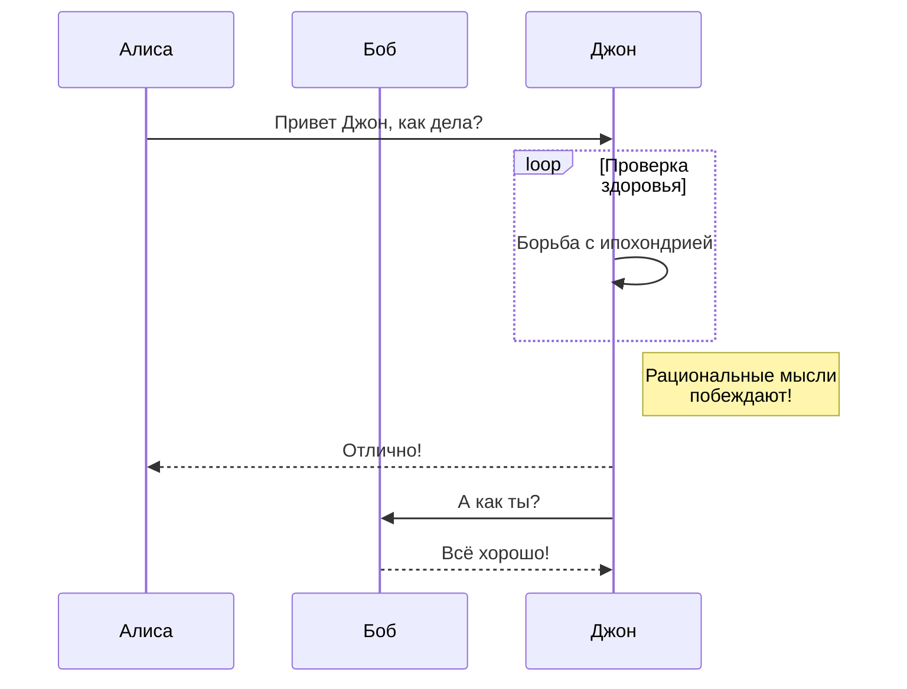
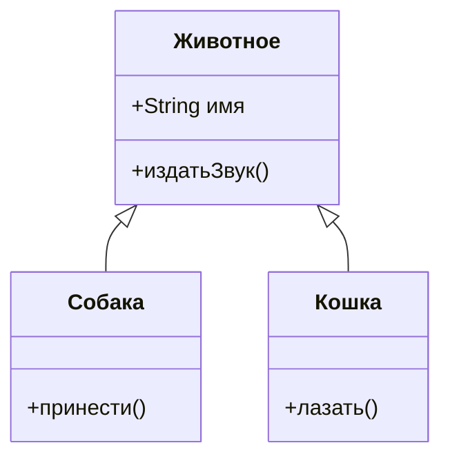
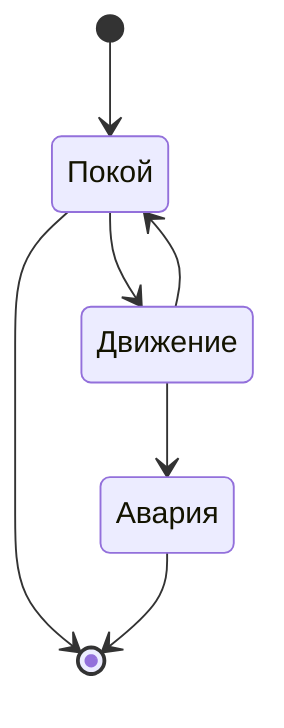
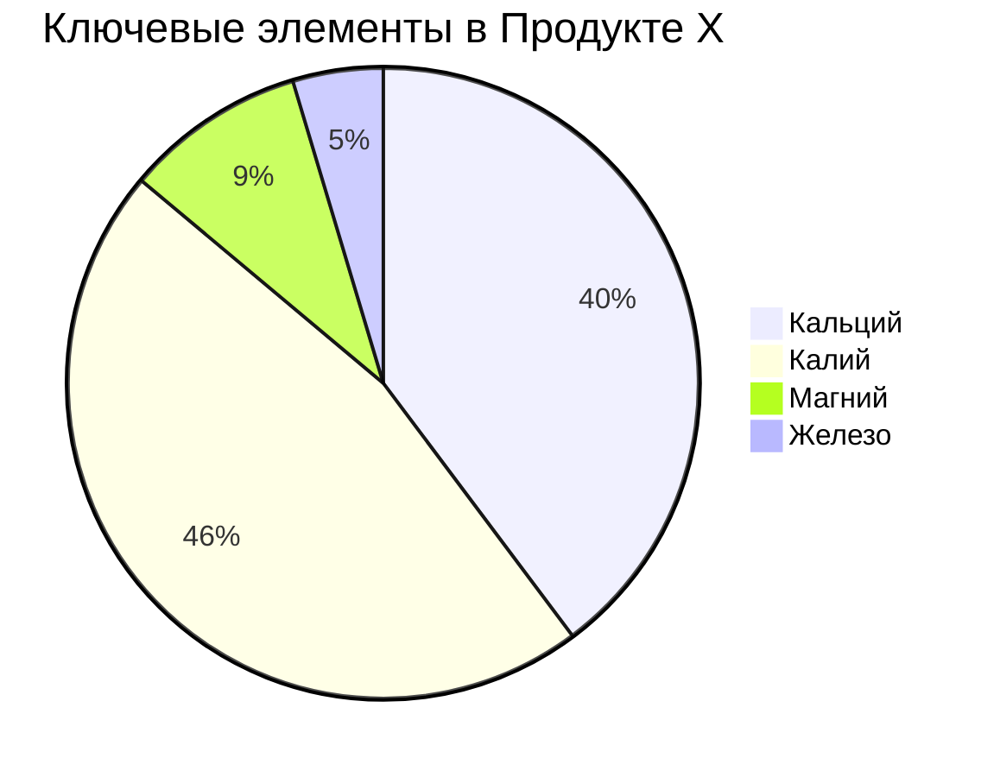

# Диаграммы

## Пример блок-схемы

```mermaid
graph TD
    A[Начало] --> B{Это так?}
    B -- Да --> C[OK]
    B -- Нет --> D[Конец]
```

## Пример диаграммы последовательности

```mermaid
sequenceDiagram
    participant Алиса
    participant Боб
    Алиса->>Джон: Привет Джон, как дела?
    loop Проверка здоровья
        Джон->>Джон: Борьба с ипохондрией
    end
    Note right of Джон: Рациональные мысли <br/>побеждают!
    Джон-->>Алиса: Отлично!
    Джон->>Боб: А как ты?
    Боб-->>Джон: Всё хорошо!
```

## Пример диаграммы классов

```mermaid
classDiagram
    class Животное {
        +String имя
        +издатьЗвук()
    }
    class Собака {
        +принести()
    }
    class Кошка {
        +лазать()
    }
    Животное <|-- Собака
    Животное <|-- Кошка
```

## Пример диаграммы состояний

```mermaid
stateDiagram-v2
    [*] --> Покой
    Покой --> [*]
    Покой --> Движение
    Движение --> Покой
    Движение --> Авария
    Авария --> [*]
```

## Пример круговой диаграммы

```mermaid
pie
    title Ключевые элементы в Продукте X
    "Кальций" : 42.96
    "Калий" : 50.05
    "Магний" : 10.01
    "Железо" :  5
``` 