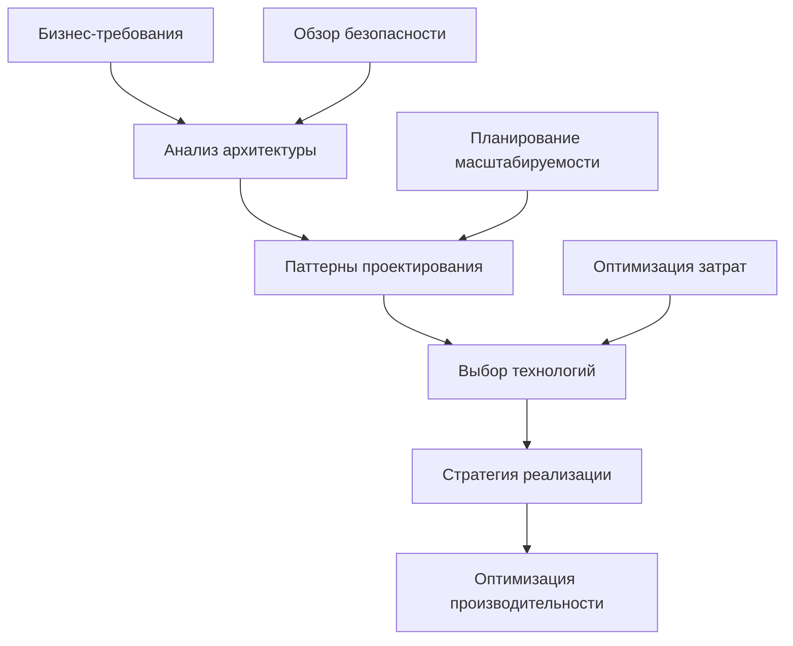

# Добро пожаловать в технический центр Майка Шогина

## Системный аналитик и IT-архитектор

```bash
$ whoami
mike.shogin
$ cat /etc/role
# Системный аналитик и IT-архитектор
# Миссия: Создание лучших систем через стратегический анализ
# Подход: Основанный на данных, методичный, ориентированный на бизнес
# Влияние: Масштабируемые решения, которые приносят реальную ценность
```

## Профессиональный обзор

Я **системный аналитик и IT-архитектор**, который помогает инженерным командам и организациям создавать лучшие системы через стратегический анализ, архитектурное руководство и техническое лидерство. Мой подход сочетает глубокую техническую экспертизу со стратегическим пониманием бизнеса для создания решений, которые приносят реальную ценность.

### Чем я занимаюсь

```yaml
основные_услуги:
  системный_анализ:
    фокус: "Методичное исследование технической инфраструктуры"
    результат: "Возможности оптимизации и стратегические дорожные карты"
    
  проектирование_архитектуры:
    фокус: "Масштабируемые, поддерживаемые системные архитектуры"
    результат: "Перспективные технические основы"
    
  техническое_лидерство:
    фокус: "Развитие команд и оптимизация процессов"
    результат: "Высокопроизводительные инженерные организации"
    
  стратегический_консалтинг:
    фокус: "Технологическая стратегия, согласованная с бизнес-целями"
    результат: "Конкурентное преимущество через технологии"
```

## Портфель услуг

### 🔍 Системный анализ и инжиниринг требований

**Превращаем бизнес-вызовы в технические решения**

```python
def system_analysis_process():
    return {
        'исследование': [
            'интервью_с_заинтересованными_сторонами',
            'оценка_текущего_состояния',
            'выявление_болевых_точек',
            'анализ_возможностей'
        ],
        'анализ': [
            'сбор_требований',
            'картирование_процессов',
            'анализ_потоков_данных',
            'оценка_интеграции'
        ],
        'проектирование': [
            'архитектура_решения',
            'дорожная_карта_реализации',
            'стратегия_снижения_рисков'
        ]
    }
```

**[Узнать больше о системном анализе →](/services/system-analysis)**

---

### 🏗️ Проектирование и обзор архитектуры

**Проектирование масштабируемых, поддерживаемых системных архитектур**



**Ключевые специализации:**
- **Облачная архитектура**: Миграция и оптимизация AWS, Azure, GCP
- **Микросервисы**: Декомпозиция монолитов и проектирование сервисов
- **Архитектура данных**: ETL-пайплайны, озера данных, аналитические платформы
- **Архитектура безопасности**: Zero-trust, соответствие требованиям, моделирование угроз

**[Изучить архитектурные услуги →](/services/architecture-audit)**

---

### 👨‍🏫 Наставничество и техническое коучинг

**Ускорьте технические и аналитические способности вашей команды**

```yaml
программы_наставничества:
  индивидуальный_коучинг:
    - персонализированное_развитие_навыков
    - планирование_карьерного_роста
    - обучение_техническому_лидерству
    
  развитие_команды:
    - создание_высокопроизводительных_команд
    - оптимизация_процессов
    - культура_обмена_знаниями
    
  переход_к_лидерству:
    - руководство_переходом_от_IC_к_менеджеру
    - принятие_технических_решений
    - коммуникация_с_заинтересованными_сторонами
```

**[Начните свой путь роста →](/services/mentorship)**

---

### 💼 Стратегический IT-консалтинг

**Согласование технологической стратегии с бизнес-целями**

| Тип проекта | Длительность | Лучше всего для | Ключевые результаты |
|-------------|--------------|-----------------|---------------------|
| **Быстрая оценка** | 2-4 недели | Немедленные инсайты | Отчет анализа + рекомендации |
| **Стратегическое проектирование** | 4-8 недель | Архитектура решения | Детальная дорожная карта + план реализации |
| **Полная реализация** | 3-6 месяца | Сквозная поставка | Работающая система + обучение команды |
| **Постоянное консультирование** | Непрерывно | Стратегическое руководство | Регулярные обзоры + оптимизация |

**[Обсудить ваши вызовы →](/services/consulting)**

## Влияние в реальном мире

### Метрики успеха

```yaml
типичные_результаты:
  улучшения_производительности:
    - время_отклика_системы: "40-70% быстрее"
    - частота_развертывания: "увеличение на 300-500%"
    - сокращение_дефектов: "на 50-70% меньше проблем"
    
  бизнес_влияние:
    - время_выхода_на_рынок: "на 25-40% быстрее"
    - операционные_затраты: "сокращение на 20-35%"
    - производительность_команды: "увеличение на 30-50%"
    - удовлетворенность_клиентов: "улучшение на 15-25%"
```

### Избранные кейсы

**🚀 Трансформация платформы электронной коммерции**
- **Вызов**: Устаревший монолит, борющийся с масштабированием
- **Решение**: Архитектура микросервисов с событийно-ориентированной интеграцией
- **Результаты**: 5x частота развертывания, 40% улучшение производительности, $2М ежегодной экономии

**🏦 Модернизация финансовых услуг**
- **Вызов**: Соответствие регулятивным требованиям и интеграция систем
- **Решение**: Архитектура event sourcing с полными аудиторскими журналами
- **Результаты**: 100% соответствие, на 90% быстрее подготовка к аудиту, обнаружение мошенничества в реальном времени

**[Просмотреть полное портфолио →](/portfolio)**

## Технологическая экспертиза

### Текущий технологический стек

```python
def technology_expertise():
    return {
        'языки': {
            'основные': ['Python', 'TypeScript', 'Java', 'Go'],
            'дополнительные': ['C#', 'Rust', 'Scala', 'SQL']
        },
        'облачные_платформы': {
            'aws': ['EC2', 'Lambda', 'RDS', 'S3', 'EKS'],
            'azure': ['App Service', 'Functions', 'AKS'],
            'gcp': ['Compute Engine', 'Cloud Functions', 'GKE']
        },
        'архитектурные_паттерны': [
            'микросервисы',
            'событийно_ориентированная_архитектура',
            'domain_driven_design',
            'cqrs_event_sourcing'
        ]
    }
```

**[Связаться со мной →](/about)** 